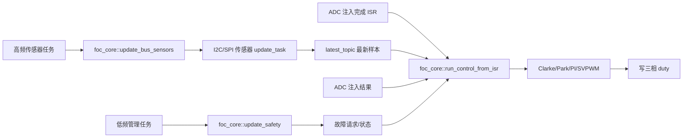

# FOC 三层执行框架评估

> 日期：2026-08-12  
> 前提：完全单实例 `foc_core`，Bus 类传感器由 RTOS 任务采集，通过最新值话题向控制 ISR 提供快照。  
> 目标：评估“控制 ISR + 高频传感器任务 API + 低频安全任务 API”的执行模型。

## 1. 结论

这个三层执行模型可行，并且与当前工程的 I2C/SPI DMA、FreeRTOS 话题和 STM32 PWM 同步 ADC 结构相匹配。

建议把三个入口明确为：

```cpp
namespace foc_core
{
    foc_result run_control_from_isr(uint32_t timestamp_us);
    foc_result update_bus_sensors();
    foc_result update_safety(uint32_t timestamp_ms);
}
```

三层职责为：

| 执行层 | 上下文 | 建议职责 |
|---|---|---|
| 控制层 | PWM 同步 ADC 完成 ISR | 读取 ADC 电流、Peek Bus 传感器快照、FOC 计算、快速保护、写 duty |
| 传感器层 | 较高频 FreeRTOS 任务 | 驱动 I2C/SPI 传感器完成采集并发布最新值 |
| 管理层 | 较低频 FreeRTOS 任务 | 慢速安全检查、健康统计、状态转换、命令超时和调试快照管理 |

推荐数据流：



但安全检查不能全部放在低频任务。必须拆成三档：

1. 硬件立即保护：比较器、门极驱动 Fault、TIM Break。
2. ISR 快速保护：过流、样本过期、NaN/Inf、母线电压无效、输出越界。
3. RTOS 慢速保护：温度、命令超时、通信健康、持续性传感器错误和状态管理。

如果把过流和样本失效只留给低频任务，框架在安全上不成立。

## 2. 三层入口只执行一步，不负责调度

建议 `foc_core` 提供可以被调度器调用的 step API，但不在核心内部创建 FreeRTOS 任务或配置中断。

```text
ADC ISR
    → run_control_from_isr()

外部高频任务
    → vTaskDelayUntil()
    → update_bus_sensors()

外部低频任务
    → vTaskDelayUntil()
    → update_safety()
```

这样做的好处：

- `foc_core` 不需要知道任务栈、任务优先级和任务句柄。
- 调度频率可以在设备层调整，不需要修改算法核心。
- 三个 API 的最坏执行时间可以分别测量。
- 以后可把高频传感器任务换成事件驱动，而不改变核心接口。

任务最终由 `start.cpp`、一个后续的 `foc_dev` 模块，或者其他板级聚合模块创建，可以稍后决定。

## 3. Bus 传感器的虚函数接口

Bus 传感器同时参与两个上下文：

- RTOS 任务负责真实通信并发布数据。
- FOC ISR 只读取已经发布的快照。

因此位置传感器接口应明确提供两个不同上下文的方法：

```cpp
class rotor_sensor
{
    public:
        virtual ~rotor_sensor() = default;

    public:
        virtual foc_result init() = 0;

    public:
        virtual foc_result update_task() = 0;
        virtual foc_result read_from_isr(rotor_sample &sample) = 0;
};
```

接口契约：

### 3.1 update_task()

- 只能在任务上下文调用。
- 可以使用 Bus Mutex、DMA 完成信号量和普通 FreeRTOS API。
- 完成一次真实传感器采集。
- 使用实际采样时刻生成 `timestamp_us`。
- 成功后发布完整 `rotor_sample`。
- 单次通信失败时返回错误，但不直接在高频任务中打印或调用 `Error_Handler()`。

### 3.2 read_from_isr()

- 只能执行 ISR 安全、非阻塞操作。
- 不发起 I2C/SPI 通信。
- 不等待 DMA、Mutex 或 Semaphore。
- 通过 `peek_from_isr()` 读取最新样本。
- 没有首个样本时返回 `SAMPLE_NOT_READY`。
- 只返回快照，不在传感器内部决定是否停机。

### 3.3 为什么不建议 foc_core 直接 include 具体 topic

概念上，`foc_core` 确实通过 Topic 得到传感器值；实现上更建议由具体传感器适配器隐藏 Topic：

```text
foc_core
    → rotor_sensor::read_from_isr()
        → as5600_rotor_sensor 内部 topic.peek_from_isr()
```

而不是：

```text
foc_core
    → 直接 include as5600_dev.h
    → 直接访问 AS5600 topic
```

这样仍满足“ISR 使用 Topic 读取”，同时保证以后换 SPI 编码器或无 Bus 编码器时不修改核心。

## 4. 具体 Bus 传感器的内部结构

AS5600 适配器可以采用：

```cpp
class as5600_rotor_sensor : public rotor_sensor
{
    public:
        as5600_rotor_sensor(uint8_t i2c_bus_id,
            uint8_t device_address);

    public:
        foc_result init() override;

    public:
        foc_result update_task() override;
        foc_result read_from_isr(rotor_sample &sample) override;

    private:
        as5600 encoder;
        topic::latest_topic<rotor_sample> sample_topic;
        uint32_t communication_error_count = 0U;
};
```

数据路径：

```text
update_task()
    → as5600::update()
    → 换算 rotor_sample
    → sample_topic.publish()

read_from_isr()
    → sample_topic.peek_from_isr()
```

Topic 必须在启用 FOC 中断前完成 `init()`，具体传感器对象必须具有静态生命周期。

当前已有 `as5600_dev` 生产任务。正式接入时不能让 `as5600_dev` 和 `as5600_rotor_sensor` 同时拥有并轮询同一个物理 AS5600，否则会形成两个生产者争抢同一总线设备。应选择一种所有权：

- 将 FOC 所需的生产和 Topic 全部迁入 `as5600_rotor_sensor`；或
- 让适配器只读取 `as5600_dev` 已发布的 ISR 安全话题。

第一种边界更完整；第二种改动较少。无论选择哪一种，都只能保留一个真实 Bus 生产者。

## 5. ADC 电流传感器不必经过 Topic

ADC 相电流与 PWM 同步，注入转换完成时数据已经在 ADC 寄存器中。建议直接通过电流传感器虚函数读取：

```cpp
class current_sensor
{
    public:
        virtual ~current_sensor() = default;

    public:
        virtual foc_result init() = 0;
        virtual foc_result calibrate_task(uint32_t sample_count) = 0;

    public:
        virtual foc_result read_conversion_from_isr(
            phase_current_sample &sample) = 0;
};
```

`read_conversion_from_isr()` 负责：

- 读取本次 ADC 注入转换结果。
- 减去零偏。
- 换算为安培。
- 修正通道方向和相别。
- 两电阻重构第三相。
- 写入本次 ISR 的微秒时间戳和序号。

ADC 数据不需要先写 Queue 再由同一个 ISR 读回。直接读取转换结果可以减少一次复制和 FreeRTOS Queue 开销。

通过 I2C/SPI 读取的慢速电流计可以加入高频传感器任务和 Topic，但一般只能用于母线监测、遥测或慢速安全检查，不能替代 PWM 同步的相电流反馈。

## 6. 控制 ISR API

推荐接口：

```cpp
foc_result foc_core::run_control_from_isr(uint32_t timestamp_us);
```

建议执行顺序：

```text
1. 检查核心是否已初始化和使能
2. 检查 pending fault / disable request
3. current_sensor.read_conversion_from_isr()
4. rotor_sensor.read_from_isr()
5. 检查样本 valid、sequence、timestamp_us 和样本年龄
6. 必要时根据速度和样本年龄前推机械角
7. 机械角换算电角度
8. Clarke / Park
9. 运行 D/Q 电流控制
10. 检查过流、NaN/Inf 和电压边界
11. 逆 Park / SVPWM
12. 写 duty
13. 更新轻量运行状态
14. 按分频更新调试快照
```

ISR 中禁止：

- 发起 Bus 通信。
- 普通 Queue/Mutex/Semaphore API。
- 阻塞等待 DMA。
- UART、`snprintf()` 和日志格式化。
- 动态内存。
- 低频复杂状态机。

Bus 传感器的同一个样本会被多个 20 kHz 控制周期重复读取，这是预期行为。不能要求 `sequence` 每个控制周期都变化，应根据样本年龄判断是否仍可使用。

## 7. 高频传感器任务 API

推荐接口：

```cpp
foc_result foc_core::update_bus_sensors();
```

首版完全单实例只有一个转子 Bus 传感器时，该 API 可以简单调用：

```text
linked_rotor_sensor->update_task()
```

这个入口只负责“推进一次 Bus 传感器生产”，不进行 FOC 计算，也不写 PWM。

建议外部任务使用 `vTaskDelayUntil()` 固定启动周期，并记录本次通信真正完成时刻。任务频率应根据以下条件实测决定：

- AS5600 和 I2C 总线能稳定达到的更新率。
- DMA 和总线任务的最长完成时间。
- 允许的角度延迟。
- 电机最高机械转速和极对数。
- 其他 I2C 设备对同一总线的占用。

当前 `as5600_dev` 设置为 1 ms，即目标约 1 kHz。它可以用于低速初步验证，但不能仅凭任务周期假设每次都严格 1 ms 完成。

### 7.1 一个入口串行更新多个 Bus 传感器的问题

如果以后同时加入：

- AS5600。
- SPI 编码器。
- Bus 母线电压计。
- Bus 温度传感器。

一个 `update_bus_sensors()` 顺序等待所有设备，会使总时间和抖动累加。届时可以改成：

- 每个传感器独立任务；或
- 非阻塞状态机；或
- 按更新分组提供多个 step API。

首版只有一个位置传感器时没有必要提前复杂化。

## 8. 低频安全任务 API

推荐接口：

```cpp
foc_result foc_core::update_safety(uint32_t timestamp_ms);
```

适合放入低频 API 的内容：

- Bus 传感器连续通信错误统计。
- 转子样本长期停止更新。
- 母线电压慢速过压和欠压确认。
- 驱动器温度。
- 命令或目标值超时。
- 电机长时间堵转判断。
- 故障恢复条件评估。
- 状态机的慢速阶段推进。
- ISR 最大执行时间和丢周期统计。
- 生成供 debug 消费者读取的状态快照。

不应只放在低频 API 的内容：

- 瞬时硬件过流。
- 本周期相电流严重越界。
- 本周期角度样本无效或超过硬截止时间。
- NaN/Inf。
- duty 越界。
- 门极驱动 Fault。

低频任务发现故障后，应锁存故障并请求硬件禁能。故障清除必须通过明确 API，不能因为下一次检查恢复正常就自动重新输出。

## 9. 三级保护模型

| 保护层 | 响应速度 | 典型保护 | 动作 |
|---|---:|---|---|
| 硬件层 | ns～µs | 短路、严重过流、驱动器故障 | TIM Break/门极驱动关断 |
| 控制 ISR | 一个控制周期，20 kHz 时约 50 µs | 软件过流、样本硬超时、NaN、输出异常 | 锁存 fault，立即 disable |
| 低频任务 | 1～100 ms，按项目设置 | 温度、通信质量、命令超时、持续性异常 | 请求 disable，记录状态 |

软件分层不能替代硬件保护。即使低频安全 API 设计完整，比较器、驱动器 Fault 和 TIM Break 仍应独立存在。

## 10. Topic 的适用性

当前 `topic::latest_topic` 已经提供：

```cpp
publish()
peek()
publish_from_isr()
peek_from_isr()
```

因此“任务生产、ISR Peek 最新值”在 API 层已经具备。

### 10.1 正确使用方式

```text
传感器任务
    → latest_topic.publish(sample)

FOC ISR
    → latest_topic.peek_from_isr(sample)
```

样本必须保持较小并且是 trivially copyable，建议只包含：

- `sequence`。
- `timestamp_us`。
- 单圈机械角。
- 机械角速度。
- 有效性/故障标志。

不要通过该 Topic 向 ISR 复制大体积历史数组或调试结构。

### 10.2 中断优先级硬约束

当前 [`FreeRTOSConfig.h`](../Core/Inc/FreeRTOSConfig.h) 配置：

```cpp
#define configLIBRARY_MAX_SYSCALL_INTERRUPT_PRIORITY 5
```

在 Cortex-M 中，数值越小代表中断优先级越高。因此：

- 优先级 5～15 的 ISR 可以调用 FreeRTOS `FromISR` API。
- 优先级 0～4 的 ISR 禁止调用任何 FreeRTOS `FromISR` API。

如果 FOC 控制 ISR 使用 `peek_from_isr()`，它必须配置为数值不小于 5。当前 TIM1/TIM8 更新中断为优先级 5，但 ADC 中断尚未启用和配置，不能直接认为 ADC 控制 ISR 已满足条件。

若以后为了降低延迟把 ADC ISR 设置为优先级 0～4，则必须把 Bus 传感器快照后端改成：

- 无锁双缓冲；或
- seqlock；或
- 只使用短临界区的非 FreeRTOS mailbox。

此时仍可保留“最新值 Topic”的抽象语义，但不能继续使用 FreeRTOS Queue 实现。

### 10.3 实时开销和抖动

`xQueuePeekFromISR()` 会进入 FreeRTOS Queue 临界区并复制完整样本。任务侧的 `xQueueOverwrite()` 也会短暂进入临界区。

这在功能上安全，但可能带来：

- 每个 20 kHz 控制周期的固定额外开销。
- 任务发布时对优先级 5 控制 ISR 的短暂屏蔽。
- 随样本尺寸增大的复制时间。

第一版可以先使用现有 Topic，但必须用 DWT 周期计数器测量：

- 单次 `peek_from_isr()` 周期数。
- 完整控制 ISR 的平均和最大周期数。
- 传感器任务发布时 ISR 延迟的最大值。

如果抖动或预算不满足，再切换无锁快照，不必提前重写 Topic 系统。

## 11. 数据时间戳和新旧判断

FOC ISR 每 50 µs 运行，而 AS5600 可能约每 1 ms 才产生一次样本。因此需要区分：

- 新样本：`sequence` 发生变化。
- 可复用旧样本：`sequence` 未变化，但年龄仍在允许范围内。
- 过期样本：年龄超过软阈值或硬阈值。

建议：

```text
sample_age_us = isr_timestamp_us - sample.timestamp_us
```

处理逻辑：

```text
age <= extrapolation_limit
    → 使用角速度进行有限前推

extrapolation_limit < age <= hard_timeout
    → 可降额或记录 warning，具体策略待定

age > hard_timeout
    → 锁存 SENSOR_STALE，立即 disable
```

具体阈值不能现在凭经验硬编码，应根据 I2C 实际更新周期、电机最高转速、极对数和允许电角度误差计算并实测。

现有 AS5600 驱动使用 FreeRTOS tick 生成毫秒时间戳。进入 FOC 路径前应改成统一微秒时基，否则 20 kHz 控制环无法可靠计算样本年龄和角度前推。

## 12. 三个上下文之间的状态所有权

三个执行上下文会访问同一个 `core_context`，必须明确谁能写什么。

建议：

| 状态 | 主要写入者 | 其他上下文操作 |
|---|---|---|
| PI、Clarke/Park 中间量、active target | 控制 ISR | 任务不能直接修改 |
| Bus 传感器 Topic | 高频传感器任务 | ISR 只 Peek |
| pending target | 命令任务 | ISR 在周期边界复制 |
| fast fault | 控制 ISR | 低频任务只读或追加慢速故障 |
| slow fault request | 低频安全任务 | ISR 在周期开始消费 |
| 调试快照 | ISR 按分频写 | debug 任务只读副本 |

不能仅使用 `volatile` 解决复合结构体的并发一致性。建议后续为以下数据设计明确 mailbox：

- `pending_target`。
- `slow_fault_request`。
- `foc_snapshot`。

可以使用极短临界区、双缓冲或现有 Topic 的正确上下文 API。低频任务不能在 ISR 正在计算时直接清零 PI、修改模式或覆盖整个 `core_context`。

## 13. 初始化顺序

建议顺序：

```text
1. CubeMX 初始化 GPIO、TIM、ADC、DMA 和 Bus
2. 创建具体 rotor_sensor/current_sensor 静态对象
3. foc_core::link_rotor_sensor()
4. foc_core::link_current_sensor()
5. 初始化传感器内部 Topic
6. foc_core::init(config)
7. 创建并启动高频传感器任务
8. 等待第一份有效转子样本
9. 在功率输出禁能时校准 ADC 电流零偏
10. 启动 PWM 计时基和 ADC 同步触发
11. 启用 ADC 控制 ISR
12. 执行低压校准和方向验证
13. 显式 foc_core::enable()
```

任何步骤失败都必须保持功率输出禁能。不能先启用控制 ISR，再初始化 Topic 或传感器指针。

## 14. API 草案

结合当前想法，`foc_core.h` 可以先规划为：

```cpp
#ifndef FOC_CORE_H
#define FOC_CORE_H

#include "drivers/foc/foc_types.h"
#include "drivers/foc/sensors/current_sensor.h"
#include "drivers/foc/sensors/rotor_sensor.h"
#include <stdint.h>

namespace foc_core
{
    foc_result link_rotor_sensor(rotor_sensor &sensor);
    foc_result link_current_sensor(current_sensor &sensor);
    foc_result set_target(const foc_target &target);
    foc_snapshot snapshot();
    foc_result enable();
    void disable();
    foc_result run_control_from_isr(uint32_t timestamp_us);
    foc_result update_bus_sensors();
    foc_result update_safety(uint32_t timestamp_ms);
    foc_result init(const foc_config &config);
}

#endif
```

命名中明确保留 `_from_isr`，避免以后在任务中误调用控制入口。`update_bus_sensors()` 和 `update_safety()` 的注释则必须声明只能在任务上下文调用。

`foc_core` 不需要导出任务入口函数；它只提供一步更新 API。

## 15. 建议的初始调度频率

下面只作为起步范围，最终以硬件测量为准：

| 入口 | 初始目标 | 备注 |
|---|---:|---|
| `run_control_from_isr()` | 与 ADC/PWM 同步，目标 20 kHz | 必须验证真实触发频率和 WCET |
| `update_bus_sensors()` | AS5600 先从稳定的约 1 kHz 开始 | 使用实际完成时间戳，不假设绝对周期 |
| `update_safety()` | 100～1000 Hz | 快保护不得依赖它 |
| debug 输出 | 10～100 Hz | 从快照读取，不进入控制链 |

高频传感器任务应高于普通 debug 和业务任务，但它仍会被控制 ISR 抢占。

## 16. 方案风险清单

| 优先级 | 风险 | 对策 |
|---|---|---|
| P0 | 低频安全任务无法及时处理瞬时过流 | 硬件 Break + ISR 快保护 |
| P0 | ADC ISR 使用 FromISR API 但优先级设为 0～4 | 保持数值优先级 ≥5，或改无锁快照 |
| P0 | Topic/传感器尚未初始化就启动控制 ISR | 严格初始化顺序，未 ready 时保持禁能 |
| P1 | AS5600 采样率和延迟不满足高速 FOC | 微秒时间戳、角度前推、超时停机、限制初测转速 |
| P1 | `as5600_dev` 和 FOC 适配器成为两个生产者 | 明确唯一物理设备所有者 |
| P1 | 任务直接修改 ISR 的 PI/模式状态 | pending mailbox，由 ISR 周期边界应用 |
| P1 | Queue FromISR 开销或任务发布导致 ISR 抖动 | DWT 测量，必要时换无锁 mailbox |
| P1 | 多个 Bus 传感器串行更新导致周期失控 | 首版只接一个，后续拆任务或异步状态机 |
| P2 | 低频 API 逐渐塞入通信和格式化 | 只保留检查与状态，UART 留在 debug 消费者 |

## 17. 最终建议

你的框架想法可以作为第一版正式方向，推荐将其表述为：

```text
foc_core::run_control_from_isr()
    强实时控制路径
    ADC 电流 + Bus 传感器最新快照 + FOC + duty + 快保护

foc_core::update_bus_sensors()
    RTOS 传感器生产路径
    允许 Bus DMA/信号量，成功后发布最新快照

foc_core::update_safety()
    RTOS 慢速管理路径
    温度、通信、命令超时、持续性故障和状态管理
```

同时固定以下边界：

1. Topic 封装在具体 Bus 传感器内，`foc_core` 通过虚函数读取，不依赖 AS5600 具体模块。
2. ADC 电流直接在 ISR 读取本次转换，不经过 Topic。
3. 快速安全判断保留在硬件和 ISR，低频任务只负责慢速安全。
4. 三个入口只执行一步，不创建任务、不设置中断。
5. 使用 FreeRTOS `peek_from_isr()` 时，控制 ISR 数值优先级必须不小于 5。
6. 三个执行上下文共享的目标、故障和快照必须使用明确 mailbox，不能直接并发修改整个核心状态。

在这些约束下，这个三层框架既足够简单，又能真实适配当前 Bus 传感器和 PWM 同步 ADC 的硬件条件。
