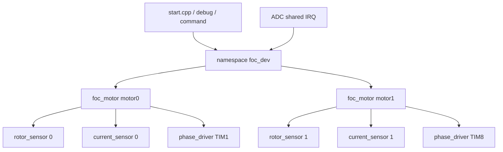

# FOC 命名空间单例架构评估

> 日期：2026-08-12  
> 目标工程：STM32F407 + C++17 + FreeRTOS  
> 前置报告：[`自研FOC库架构设计评估.md`](自研FOC库架构设计评估.md)  
> 讨论范围：使用 `namespace` 函数和 `.cpp` 内静态状态组成单例，不讨论堆分配式 Singleton。

## 1. 结论

采用 namespace 构成 FOC 单例在技术上完全可行，也能继续通过虚函数 `link` 位置传感器、电流传感器和 PWM 驱动。但它更适合“项目设备聚合层”，不适合替代要求多实例的通用 FOC 核心库。

对当前工程最合适的结构是：

```text
drivers/foc/
    foc_motor 类               可实例化的算法核心
    rotor_sensor 抽象类        虚函数硬件边界
    current_sensor 抽象类
    phase_driver 抽象类

devices/foc_dev.h/.cpp
    namespace foc_dev          项目级单例外观
    内部静态创建 motor0/motor1
    负责 link、初始化和 ISR 分派
```

也就是：

> 库内保持多实例，设备层提供 namespace 单例调用方式。

这样既能获得简洁的：

```cpp
foc_dev::init();
foc_dev::set_target(foc_motor_id::MOTOR0, target);
foc_dev::run_motor0_current_loop_from_isr(timestamp_us);
```

又不会丢掉两个电机状态相互独立、算法可测试、硬件可替换和以后复用库的能力。

如果确定整个产品永远只有一台电机，且这套代码不会作为通用库复用，那么纯 namespace 单例也可以接受；但这与上一份报告中的“支持多实例”目标不一致。

## 2. 什么是 namespace 单例

namespace 本身不是对象，也不是 C++ 语言层面的 Singleton 类。这里所说的 namespace 单例，通常是指：

- 头文件只导出 namespace 函数。
- `.cpp` 中用 `static` 保存唯一一份模块状态。
- 外部无法构造第二份状态。
- 通过显式 `init()` 完成初始化。

例如：

```cpp
#ifndef FOC_CORE_H
#define FOC_CORE_H

#include "current_sensor.h"
#include "foc_types.h"
#include "phase_driver.h"
#include "rotor_sensor.h"

namespace foc_core
{
    foc_result link_rotor_sensor(rotor_sensor &sensor);
    foc_result link_current_sensor(current_sensor &sensor);
    foc_result link_driver(phase_driver &driver);
    foc_result enable();
    void disable();
    foc_result run_current_loop_from_isr(uint32_t timestamp_us);
    void set_target(const foc_target &target);
    foc_snapshot snapshot();
    foc_result init(const foc_config &config);
}

#endif
```

对应实现的大致结构为：

```cpp
#include "foc_core.h"

#include "foc_math.h"
#include "pi_controller.h"

static foc_config current_config{};
static foc_runtime runtime{};
static pi_controller d_axis_pi;
static pi_controller q_axis_pi;
static rotor_sensor *linked_rotor_sensor = nullptr;
static current_sensor *linked_current_sensor = nullptr;
static phase_driver *linked_driver = nullptr;
static bool initialized = false;
```

这种结构不需要 `get_instance()`，也不需要局部静态对象，因此比传统 Singleton 类更适合无异常、无 RTTI、无动态内存的 MCU 工程。

## 3. namespace 单例仍然可以使用虚函数 link

namespace 和虚函数并不冲突。namespace 只负责持有抽象接口指针：

```cpp
static rotor_sensor *linked_rotor_sensor = nullptr;
static current_sensor *linked_current_sensor = nullptr;
static phase_driver *linked_driver = nullptr;
```

link 函数保存非拥有型指针：

```cpp
/**
 * @brief 绑定唯一 FOC 核心使用的转子位置传感器
 *
 * @param sensor 具有静态生命周期的转子传感器对象
 *
 * @return 绑定结果
 */
foc_result foc_core::link_rotor_sensor(rotor_sensor &sensor)
{
    if(initialized)
    {
        return foc_result::INVALID_STATE;
    }

    linked_rotor_sensor = &sensor;
    return foc_result::OK;
}
```

高频环仍通过虚函数读取：

```cpp
rotor_sample rotor_data{};
foc_result result = linked_rotor_sensor->read_latest(rotor_data);
```

因此选择 namespace 并不会减少传感器抽象能力，也不会自动消除虚函数开销。class 成员函数中的 `sensor->read_latest()` 与 namespace 函数中的同一调用，本质上都是一次虚函数分派。

必须保持之前的接口约束：

- link 对象具有静态生命周期。
- FOC 单例不负责 `delete`。
- 初始化完成或电机使能后禁止重新 link。
- 高频虚函数必须非阻塞、ISR 安全。
- AS5600 的 RTOS/I2C 读取不能因为包进虚函数就直接进入 FOC ISR。

## 4. 纯 namespace 单例的优点

### 4.1 调用方式直接

ISR 和 C 回调桥接很简单：

```cpp
extern "C" void HAL_ADCEx_InjectedConvCpltCallback(
    ADC_HandleTypeDef *hadc)
{
    if(hadc->Instance == ADC1)
    {
        foc_core::run_current_loop_from_isr(read_timestamp_us());
    }
}
```

没有对象引用需要从 C 回调中查找，也不需要暴露实例 getter。

### 4.2 生命周期明确

所有静态存储在启动时先完成零初始化，再由 `init()` 显式配置。只要不在静态对象构造函数中访问其他模块，就可以避免跨编译单元静态初始化顺序问题。

### 4.3 没有堆内存和空实例问题

- 不使用 `new/delete`。
- 不存在实例被移动或提前析构。
- 不需要检查用户传入的是哪一个 `foc_motor` 对象。
- 链接器可以清除没有使用的函数和只读表。

### 4.4 符合当前项目设备层风格

当前工程的 `as5600_dev`、`mpu6050_dev` 和 `sensor_debug` 已经使用 namespace 模块形式。对于“本块板卡上固定存在的一组设备”，namespace 单例具有一致的调用体验。

### 4.5 适合固定单电机产品

如果硬件永远只有：

```text
一个 TIM
一个 ADC 电流采样组
一个位置传感器
一套门极驱动
```

并且代码不打算作为独立库复用，纯单例能以较少样板代码完成任务。

## 5. 纯 namespace 单例的缺点

### 5.1 从结构上禁止多实例

namespace 只有一份静态状态：

```text
一个 d_axis_pi
一个 q_axis_pi
一个 rotor_sensor 指针
一个 current_sensor 指针
一个 phase_driver 指针
一个 fault_state
```

第二台电机无法获得独立状态。再次调用 `link_*()` 只会覆盖第一台电机的绑定。

当前工程已有：

- TIM1 + ADC1 候选 motor0。
- TIM8 + ADC2 候选 motor1。

因此纯单例会主动放弃现有双电机硬件结构带来的扩展空间。

### 5.2 容易重新形成 SguanFOC 式全局状态

参考库的问题并不只是变量名为 `Sguan`，而是所有模块都围绕唯一状态工作。把它改成：

```cpp
namespace foc
{
    // 大量模块全局状态
}
```

并没有解决耦合，只是把全局结构体变成 namespace 静态变量。

如果纯 namespace 方案继续把 PI、滤波、传感器、保护、通信和状态机都塞进同一个 `.cpp`，其可维护性会逐渐接近参考库的全局单体结构。

### 5.3 状态归属依赖人工纪律

class 可以通过成员关系自然表达：

```text
motor0.d_axis_pi
motor1.d_axis_pi
```

纯 namespace 只能依靠变量前缀和文件边界约束状态。新增函数内 `static` 变量时，很容易再次引入所有路径共享的隐式状态。

### 5.4 测试隔离较差

单元测试只能共享同一份模块状态：

- 每个测试前必须调用完整 `reset_for_test()`。
- 无法在同一个测试中并排运行两个不同配置。
- mock 传感器被重新 link 后会影响后续测试。
- 测试通常必须串行执行。

class 实例可以在每个测试函数中独立创建，状态天然隔离。

### 5.5 复用和配置能力较弱

一个通用库用户通常期望：

```cpp
foc_motor left_motor(left_config);
foc_motor right_motor(right_config);
```

纯 namespace 只能提供唯一配置。若要用于另一块板卡，项目往往需要改库内部静态变量，而不是只在设备层创建不同实例。

### 5.6 无法使用语言层面的对象约束

namespace：

- 没有构造函数和析构函数。
- 不能删除复制、移动操作，因为根本不存在对象。
- 没有 `private` 成员，只能依靠 `.cpp` 静态作用域隐藏。
- 不能作为另一个模块的组合成员。
- 不能把两个核心实例传给同一个算法测试函数。

这些不是运行障碍，但会让边界更多依靠约定而不是类型系统。

## 6. 性能和资源占用并不会明显更好

纯 namespace 常被认为比 class 更轻，但对这里的设计，差异基本可以忽略。

### 6.1 RAM

下面两种状态占用近似相同：

```cpp
static pi_controller d_axis_pi;
```

和：

```cpp
static foc_motor motor0;
```

只要 `foc_motor` 不包含不需要的字段，其成员总大小就是 namespace 静态变量总大小。class 不会自动增加对象头；只有类本身拥有虚函数时才会增加虚表指针。本方案中的 `foc_motor` 不需要成为虚基类。

### 6.2 FLASH

namespace 函数和非虚 class 成员函数都会编译成普通函数。成员函数多传递一个 `this` 指针，但编译器通常会把它放入寄存器，并不意味着显著代码膨胀。

传感器和驱动的虚函数调用在两种方案中都存在。

### 6.3 执行时间

Clarke、Park、PI 和 SVPWM 的浮点计算成本远高于一次对象地址传递。是否使用 namespace 不应作为高频环性能优化手段。

真正需要测量的是：

- 传感器虚函数实际实现。
- ADC 数据处理。
- 三角函数。
- 电流 PI 和前馈。
- SVPWM。
- HAL 或寄存器方式写 PWM。
- 双电机 ISR 冲突时的最坏延迟。

## 7. 支持双电机的三种 namespace 变体

### 7.1 复制两个 namespace

```cpp
namespace motor0_foc
{
    void init();
    void run_current_loop_from_isr(uint32_t timestamp_us);
}

namespace motor1_foc
{
    void init();
    void run_current_loop_from_isr(uint32_t timestamp_us);
}
```

优点是调用直观；缺点是算法和状态声明容易复制两份。即使内部调用同一组 helper，也需要维护两套静态上下文和两套外部 API。

不推荐将这种方式用于 FOC 核心库。

### 7.2 namespace 内保存固定上下文数组

```cpp
enum class foc_motor_id : uint8_t
{
    MOTOR0 = 0,
    MOTOR1,
    COUNT
};

namespace foc_core
{
    foc_result run_current_loop_from_isr(foc_motor_id motor_id,
        uint32_t timestamp_us);
}
```

`.cpp` 中保存：

```cpp
static foc_context motor_contexts[
    (uint8_t)foc_motor_id::COUNT]{};
```

这可以支持两个逻辑实例，但本质上是手工实现了一组对象：

- 每个函数都要接收并检查 `motor_id`。
- 每次都要从数组取出上下文。
- 配置错误可能把数据写入错误槽位。
- 不同硬件实例的绑定仍要保存在每个 context 中。
- 独立测试和库复用不如直接使用 class。

如果电机数量固定、API 必须是 C 风格，而且团队明确不使用 class，这是一种可接受方案；否则没有明显优势。

### 7.3 namespace 外观持有多个 class 实例

```cpp
namespace foc_dev
{
    foc_result set_target(foc_motor_id motor_id,
        const foc_target &target);
    foc_snapshot snapshot(foc_motor_id motor_id);
    void run_motor0_current_loop_from_isr(uint32_t timestamp_us);
    void run_motor1_current_loop_from_isr(uint32_t timestamp_us);
    void init();
}
```

`.cpp` 内部：

```cpp
static stm32_three_phase_driver motor0_driver(/* TIM1 */);
static stm32_two_shunt_current_sensor motor0_current(/* ADC1 */);
static as5600_rotor_sensor motor0_rotor(/* bus0 */);
static foc_motor motor0(motor0_config);

static stm32_three_phase_driver motor1_driver(/* TIM8 */);
static stm32_two_shunt_current_sensor motor1_current(/* ADC2 */);
static as5600_rotor_sensor motor1_rotor(/* bus1 */);
static foc_motor motor1(motor1_config);
```

这就是推荐方案。外部看到的是 namespace 单例，内部仍保持标准多实例核心。

## 8. 推荐的混合架构



职责边界：

| 模块 | 形式 | 职责 |
|---|---|---|
| `foc_math` | namespace 纯函数 | Clarke、Park、限幅、SVPWM，无可变状态 |
| `pi_controller` | class | 每个控制器独立的积分和抗饱和状态 |
| `foc_motor` | class | 每台电机完整控制状态和 link 指针 |
| 传感器/驱动接口 | 抽象 class | 虚函数硬件边界 |
| `foc_dev` | namespace 单例 | 创建固定实例、绑定硬件、ISR 分派、设备 API |
| `sensor_debug` | namespace 单例 | 消费低频快照并打印 |

这种划分也符合一个实用原则：

- 无状态算法使用 namespace。
- 有独立运行状态且需要多份的实体使用 class。
- 整块板卡唯一的设备组合使用 namespace。

## 9. 推荐头文件接口

### 9.1 drivers/foc/foc_motor.h

保持多实例核心：

```cpp
class foc_motor
{
    public:
        explicit foc_motor(const foc_config &config);
        foc_motor(const foc_motor &) = delete;
        foc_motor &operator=(const foc_motor &) = delete;

    public:
        foc_result link_rotor_sensor(rotor_sensor &sensor);
        foc_result link_current_sensor(current_sensor &sensor);
        foc_result link_driver(phase_driver &driver);

    public:
        foc_result init();

    public:
        foc_result enable();
        void disable();
        foc_result run_current_loop_from_isr(uint32_t timestamp_us);
        void set_target(const foc_target &target);
        foc_snapshot snapshot() const;
};
```

### 9.2 devices/foc_dev.h

提供 namespace 单例外观：

```cpp
#ifndef FOC_DEV_H
#define FOC_DEV_H

#include "drivers/foc/foc_types.h"

enum class foc_motor_id : uint8_t
{
    MOTOR0 = 0,
    MOTOR1
};

namespace foc_dev
{
    foc_result enable(foc_motor_id motor_id);
    void disable(foc_motor_id motor_id);
    foc_result set_target(foc_motor_id motor_id,
        const foc_target &target);
    bool peek_latest(foc_motor_id motor_id,
        foc_snapshot &snapshot);
    void run_motor0_current_loop_from_isr(uint32_t timestamp_us);
    void run_motor1_current_loop_from_isr(uint32_t timestamp_us);
    void init();
}

#endif
```

说明：

- `init()` 在设备层内部完成两个 motor 的 `link_*()`。
- 高频 ISR 使用两个明确入口，避免每周期按 `motor_id` 做通用分派。
- 任务侧命令和调试接口可以使用 `motor_id`，调用频率低，边界检查成本无关紧要。
- `peek_latest()` 沿用当前设备层隐藏话题存储的风格。
- `drivers/foc` 不依赖 FreeRTOS；话题保留在 `foc_dev.cpp` 内部。

## 10. ISR 与并发边界

采用 namespace 外观不会改变并发约束。

### 10.1 高频入口

建议 ADC 共享中断只做硬件标志判断和明确分派：

```text
ADC1 注入完成
    → foc_dev::run_motor0_current_loop_from_isr()

ADC2 注入完成
    → foc_dev::run_motor1_current_loop_from_isr()
```

每个入口只操作对应的 `foc_motor` 实例，不允许两个中断路径操作同一实例。

### 10.2 任务写目标

任务修改目标而 ISR 读取目标时，需要稳定快照。不能因为 API 位于 namespace 中就直接无保护地修改多个 float 字段。

可以选择：

- 短临界区复制完整 `foc_target`。
- 双缓冲加索引切换。
- 任务通知只负责唤醒，数据仍使用稳定快照。

目标更新不应在高频 ISR 中调用普通 Queue/Mutex API。

### 10.3 调试快照

高频环按分频生成快照，设备层使用 ISR 安全方式发布；debug 消费者低频 Peek。UART 和格式化不进入 `foc_dev` 的 ISR 函数。

## 11. 初始化方式

namespace 单例应坚持显式初始化，不依赖跨文件静态构造顺序：

```text
CubeMX 初始化 GPIO/TIM/ADC
    → foc_dev::init()
        → link motor0 hardware
        → link motor1 hardware
        → motor0.init()
        → motor1.init()
        → 保持 driver disabled
    → 启动 PWM 基准和 ADC 注入触发
    → 完成电流零偏校准
    → 显式 enable 指定电机
```

内部静态对象的构造函数只保存配置和句柄，不应启动外设、延时或访问其他全局对象。

如果某一步失败，`foc_dev::init()` 应锁存错误并保持两套门极禁能，不能调用 `Error_Handler()` 后仍留下某台电机输出活动。

## 12. 什么时候可以选择纯 namespace 单例

满足下面大部分条件时，纯 namespace FOC 核心是合理选择：

- 产品确定只有一台电机。
- 不要求同一固件运行第二台电机。
- 不打算把 FOC 核心作为通用库迁移到其他项目。
- 单元测试需求较低或可以完整重置全局状态。
- 硬件绑定在编译期固定。
- 团队更看重 C 风格函数 API，而不是对象组合。

这种情况下仍应拆文件：

```text
foc_math             无状态 namespace
foc_controller       唯一控制状态
foc_sensor_binding   唯一 link 指针
foc_safety           唯一故障状态
```

不要把所有内容集中到一个几千行 `.cpp`。

## 13. 什么时候不应选择纯 namespace 单例

出现以下任一核心需求时，应保留 class 多实例：

- 同时控制两台电机。
- 同一工程需要两套不同 PI、极对数、相序或采样参数。
- 需要在主机测试中同时比较两个控制器。
- 需要把库移植到不同板卡而不修改库内部状态。
- 需要为同一算法绑定不同的 mock 传感器。
- 希望上层控制器持有或组合多个电机对象。

当前工程已经具备 TIM1/ADC1 与 TIM8/ADC2 两套资源，并且原始需求明确希望支持多实例，所以不建议让 `drivers/foc` 退化为纯 namespace 单例。

## 14. 三种方案对比

| 维度 | 纯 namespace 单例 | namespace + context 数组 | namespace 外观 + class 实例 |
|---|---|---|---|
| 外部调用简洁 | 好 | 好 | 好 |
| 单电机实现成本 | 最低 | 中等 | 中等 |
| 双电机 | 不支持 | 支持固定数量 | 原生支持 |
| 状态隔离 | 无 | 手工按槽位隔离 | 类型自然隔离 |
| 虚函数 link | 支持 | 支持 | 支持 |
| 单元测试 | 较差 | 一般 | 最好 |
| 库复用 | 较差 | 一般 | 最好 |
| ISR 调用成本 | 低 | 多一次 ID/索引 | 低 |
| 动态内存 | 不需要 | 不需要 | 不需要 |
| 与当前 devices 风格一致 | 适合 devices | 适合固定管理器 | 最适合 |
| 推荐程度 | 仅固定单电机 | 有特殊限制时 | 当前工程首选 |

## 15. 最终建议

建议维持上一份报告的核心方向，但在应用层加入 namespace 单例外观：

```text
可复用、多实例、可测试的部分
    → drivers/foc 中使用 class

无状态数学算法
    → drivers/foc 中使用 namespace

当前板卡唯一的双电机组合与 ISR 分派
    → devices/foc_dev 中使用 namespace 单例
```

这比“所有内容都用 class”更贴合当前项目风格，也比“所有内容都用 namespace 静态状态”更能保证双电机隔离。

推荐最终调用关系：

```cpp
foc_dev::init();

foc_target target{};
target.target_iq_a = 0.2f;
foc_dev::set_target(foc_motor_id::MOTOR0, target);
foc_dev::enable(foc_motor_id::MOTOR0);
```

ISR 内部则保持明确、固定且无查找：

```cpp
foc_dev::run_motor0_current_loop_from_isr(timestamp_us);
```

因此最终判断是：

> namespace 单例值得采用，但应放在 `devices/foc_dev` 作为板级外观；`drivers/foc` 的有状态核心仍应保留 `foc_motor` 多实例类。纯 namespace 单例只有在明确放弃双电机和通用库目标时才更合适。
