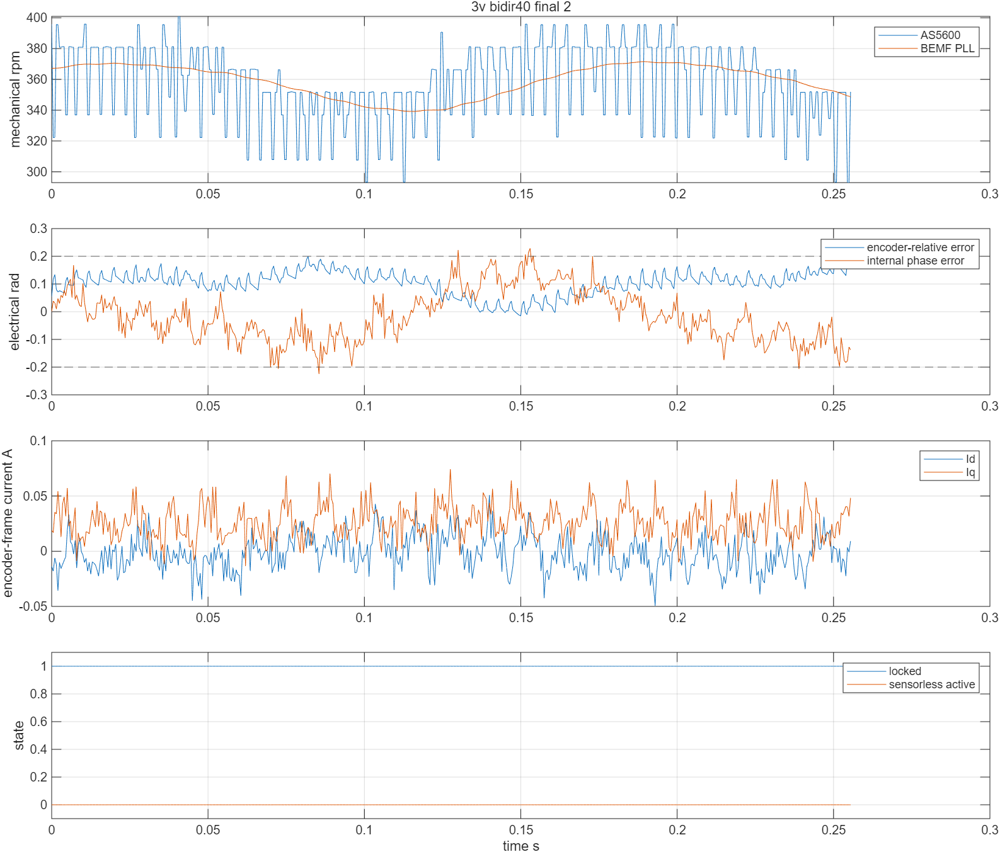
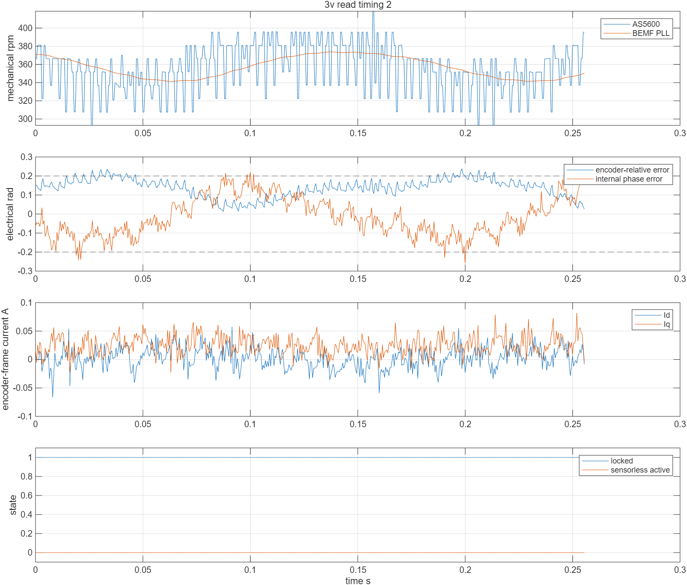

# 3 V 启动、编码器热复位与第二轮 PLL 实验

本轮继续在 `test/pll` 工作。恢复了可持续数秒的编码器 FOC 转动，反电势 PLL 的速度可以跟随，部分记录保持内部锁定；**尚未满足接管条件，没有执行无感反馈接管，更没有完成无编码器启动。** 反复启动后的角度偏差和对齐零点一致性仍是需要解决的问题。

第一轮记录及当时的配置见 [实机记录](实机记录.md)，基础理论和 MATLAB 操作见 [学习教程](学习教程.md)。本文件解释本轮改动、观察和复现步骤。实机原始记录见 `results/hardware/3v/`，不同试验使用了不同固件，不能混作同一版本的连续数据。

## 1. 3 V 与 0.03 A 分别是什么

12 V 是直流母线电压。3 V 是对齐时施加的定子电压向量幅值，由 PWM 合成，并非把电源改成 3 V。

`Iq=0.03 A` 是 q 轴电流目标，用于产生转矩；它不等于启动对齐电流，也不等于直流电源表读数。电机启动对齐时用 3 V 的 d 轴电压拉住转子。本轮有效保护路径测到相电流峰值约 1.56～1.65 A，上限仍为 1.8 A。

0.03 A 确实很小，但实机记录不是静止：`3v_low_current_1.csv` 的编码器平均速度约为 516.5 rad/s **电角速度**，换算机械转速约为 704.6 rpm。电机已跨过摩擦。此时实际电流仍有偏差：参考坐标中的平均 `Id≈0.114 A`、`Iq≈0.045 A`，因此不能声称电流控制已调好。

直接给恒定转矩会不断加速，直到摩擦、反电势或电压限制平衡。把电流加大不等于“稳定在一个适合 PLL 的转速”。第一次 0.10 A 试验在约 0.124 s 后触发 D 轴电流保护，最后 `Id≈0.538 A`；这次运行没有新增编码器通信错误。

后续使用受限速度试验：机械目标默认 40 rad/s（约 382 rpm），q 轴电流上限 0.10 A，电流目标变化率约 0.5 A/s，电压向量上限 3 V。简单比例速度调节为：

\[
I_q^*=\operatorname{clip}\left[0.020+0.002(\omega_m^*-\omega_m),\ 0,\ 0.10\right].
\]

启动可用较大电流，达到转速后降到维持摩擦所需的电流。实机 40 rad/s 目标下测到约 356～369 rpm，而非强行保持 0.10 A 一直加速。这个调节器用于实验，没有调成产品级速度控制器。只允许正向目标 5～60 rad/s；超出范围或非有限数值会请求停车。

## 2. 与 foc_test 的比较和 SVPWM 修正

读取了 `foc_test` 的 `e709260` 版本源码；本轮没有把该分支整套固件烧回。用户记忆中的稳定固件不能仅凭分支名称确认具体提交。

| 项目 | foc_test 源码 | 本轮最终实验配置 |
| --- | --- | --- |
| 对齐/开环电压 | 3 V | 3 V 对齐及慢速正反电角度扫描 |
| 双电流采样 | A/B，符号 +1/−1 | A/B，符号 +1/−1 |
| 相 PWM | U/V/W→TIM8 CH3/CH2/CH1，直接占空比 | 同一通道映射，`PWM_Dir=+1` |
| 相电流上限 | 1.8 A | 1.8 A，启动阶段也检查 |
| 控制更新 | 10 kHz | 20 kHz，50 μs |
| AS5600 读取 | 阻塞读取，短超时 | 阻塞读取，1 ms 锁超时、2 ms 传输超时 |
| PI | 自有 FOC 实现 | SguanFOC，Kp=0.2995、Ki=300，输出±3 V，积分±1 V |

原 Sguan SVPWM 的软件电压尺度存在 `1/√3` 增益差。通过占空比计算重建，3 V 指令约为 1.73 V。这是**软件单位检查结果，未用示波器测得实际绕组电压**。

现在使用标准逆 Park、三相变换和公共零序居中：

\[
u_A=u_\alpha,\quad u_B=-u_\alpha/2+\sqrt3u_\beta/2,\quad u_C=-u_\alpha/2-\sqrt3u_\beta/2,
\]
\[
u_0=-\tfrac12(\max u_{ABC}+\min u_{ABC}),\qquad d_k=\tfrac12+u_k+u_0.
\]

这里输入已除以母线电压。向量限制在线性区 `1/√3`，非有限输入输出中性占空比。主机测试在 360 个角度上从占空比重建 α/β 电压，检验物理单位和幅值，另检查限幅及 NaN。

还修正了两个控制实现问题：

- `disable()` 原来只清目标和软件标志，未拉低 `MOTOR_EN`。现在立即关驱动；普通待机保留 MOE 供 ADC 触发，实验停止则同时清 MOE。
- D/Q 两个 PI 原来共享函数内静态积分冻结标志。现在冻结状态属于各自 PI 实例，初始化会清除。测试验证一个轴饱和不会冻结另一个轴，反向误差和复位能解除冻结。

## 3. MCU 复位为什么可能卡住编码器通信

驱动板给 AS5600 供电，MCU 重刷或复位时 AS5600 不掉电。复位若发生在 I²C 事务中途，外设可能仍等待后续时钟，SDA 被拉低；MCU 自己的 I²C 状态也可能残留 BUSY。只重新调用 HAL 初始化未必能恢复整条总线。

总线恢复现在按下面顺序执行：取消当前事务，停用外设，GPIO 改为开漏，释放 SCL/SDA，检查真实电平；SDA 低时最多补 9 个时钟，然后生成 STOP，再复位并重新初始化 STM32 I²C 外设。释放高电平依靠上拉，**没有推挽强行拉高**。SCL 被外部拉低时最多等约 500 μs，失败返回；硬件持续短路或器件挂死不能靠无限循环解决。[NXP UM10204](https://www.nxp.com/docs/en/user-guide/UM10204.pdf)

DMA 回调可能先于 STOP 完成。事务前增加最多约 200 μs 的空闲等待，避免把短暂 BUSY 立即当作卡死。通用总线仍支持 DMA；本次 AS5600 用短超时阻塞读取，与 foc_test 的方式一致。已有互斥锁和完成信号量在重试初始化时复用。

`i2c_bus_debug[0]` 可读恢复次数、失败次数、成功/失败事务数、HAL 错误和恢复前后线路。`last_lines_*` 的 bit0=SCL、bit1=SDA，值 3 表示两线都高。计数从 MCU 启动开始，**一次成功读取可能经历内部重试**，所以 AS5600 错误计数为零不代表从未发生 NACK 或恢复。不能把总线恢复次数全部归因于永久卡死。

AS5600 还保留跨初始化重试的错误次数、连续错误次数、上次成功时间。运行中编码器数据超过 5 ms 未更新会关断；模拟测试覆盖了 SDA 卡住、SCL 卡住、时钟延展和补钟上限。实物没有人为短接 SDA/SCL，真实短路故障未验证。

最终固件实测三次 MCU-only reset，AS5600 全程不断电，均恢复采样并到达 READY；成功样本计数分别为 7175/7171/7173。三个启动的最终通信错误数为 0/2/1，恢复失败数为 0/2/1，后续读取恢复成功，不能称为“完全无通信异常”。三次正反零点差分别 0.01007/0.01041/0.00906 rad，相电流峰值约 1.60 A，每次都以 MOTOR_EN=0、MOE=0 结束。记录为 `3v_warm_reset.json`。

## 4. AS5600 的滤波与参考误差

读取完成的时间戳不等于磁场被采样的精确时刻。AS5600 内部滤波、I²C 传输和任务调度都会造成延迟，快转时变成角度差：\(\Delta\theta_e\approx\omega_e\tau\)。例如 0.5 ms 在 800 rad/s 时就是 0.4 rad。

官方数据表给出 SF=00/01/10/11 的阶跃响应延迟约 2.2/1.1/0.55/0.286 ms；这不是可以直接套入所有工况的纯延迟标定值。[AS5600 数据表](https://look.ams-osram.com/m/7059eac7531a86fd/original/AS5600-DS000365.pdf)

本实验的 AS5600 初始化采用可选低延迟模式：读改写并回读 CONF，SF=11、FTH=0、普通供电模式、关闭 watchdog；保留输出类型、PWM 和迟滞设置。已回读到 `0x0300`。**没有写 OTP BURN，也没有改变永久角度设置。** MCU 热复位不会重置这个寄存器，所以每次启动都核对；编码器重新上电会恢复其永久配置。其他使用此驱动的调用默认不启用这个模式。

先前的试验没有记录修改前的 CONF，不能证明最初板子一定为默认 SF=00。改变设置后低速记录的偏差明显减小，支持“延迟是误差来源之一”，不证明它是唯一原因。I²C1 进一步改为 400 kHz，I²C2 保持原设置。

STATUS 原始值曾读到 `0xB3`：按 AS5600 的位定义，MD=1、ML=1，并含未定义位。因此需要核对器件型号、磁铁距离、居中和固定情况，不能把这个值当成“磁场正常”的证明。AGC 和 MAGNITUDE 也加入诊断。这里还没有独立校准过编码器的角度真值。

三次热复位又读到 AGC=128、MAGNITUDE=1224/1222/1223，数值稳定，AGC 并未处于最大值。因此 STATUS 的含义存在需要核对的地方，**不能只凭 ML 位就断定磁场过弱**，也没有把 MAGNITUDE 换算为已标定的磁场强度。

最后增加 `last_read_duration_us` / `max_read_duration_us`，在调用总线读取前后计时，包含互斥等待、重试和任务被中断的时间。`3v_read_timing.json` 的三个运行窗口分别读到 299/253/299 μs；待机约 138～192 μs。启动以来最大值 2935 μs 包含恢复，不能把它当成每次读取耗时。启动错误数为 4，运行期间保持为 4，没有新增通信错误。

在约 270 rad/s 电角速度下，300 μs 对应约 0.081 rad。这说明读取结束时间戳可能显著影响比较，但**总耗时无法确定芯片采样或寄存器锁存发生在哪个时刻**，所以当前仍保留完成时间戳，没有直接扣除整个耗时，也没有拟合角度平移。本次计时固件的最长接管资格为 3027 个周期（151.35 ms），再次启动后的结果未复现先前最佳值；三个窗口均未接管。

## 5. 启动对齐的一致性

最终启动流程：中性 PWM、驱动关闭完成电流零偏校准；3 V 固定电角度保持 1 s；2 s 正向扫描一电周期；保持 100 ms 并平均 32 个角度；再用 2 s 反向扫描，保持并平均；完成后关闭对齐电压、等待 800 ms，进入待机。

一电周期应对应约 `2π/7≈0.8976 rad` 的机械位移，正反方向相反。方向从正向扫描的编码器位移推断，不能只照抄符号。对齐零点由初始、正向末端、反向末端三个**已知施加电角度**独立求平均，没有拿反电势 PLL 的误差来人为平移参考角。

平均时先乘极对数，再把差值包回 `[-π,π)`，避免相邻磁极和机械 0/2π 跨越导致错误平均。三次电零点相对反向末端的最大差超过 0.30 rad，或者反向运动不反向，就拒绝进入 READY。

首个正反试验测到：正向 −0.85510 rad，反向 +0.85203 rad，电零点最大差 0.31897 rad。保护拒绝启动，`MOTOR_EN=0`、MOE=0。这提示对齐/编码器参考存在不一致，**不能仅通过增加运行电流或降低 PLL 接管门槛解决**。静态摩擦、齿槽转矩、磁场干扰和编码器非线性都可能参与，当前未确定唯一原因。

首个 3 V 单向试验的启动电流保护分支曾因状态门控而未执行，`startup_max_phase_a=0`；这个记录不能用于证明启动电流保护有效。发现后修复了 INITIALIZING 状态门控，随后记录才测到 1.56～1.65 A 的峰值。

## 6. 反电势 PLL 的锁定与接管

仍采用观测器自然频率 6000 rad/s、阻尼 1、PLL 自然频率 60 rad/s，50 μs 步长。尝试了观测器 2000 rad/s：MATLAB 的随机 ADC 噪声仿真得到较小内部相位噪声，但实机平均角度偏差增加，未满足接管条件，所以返回 6000 rad/s。**模型上的降噪收益不等于板上一定更好。**

内部锁定改为：10 ms 时间常数的相位误差平方均值小于 `0.15²`，瞬时误差小于 0.45 rad，速度沿指定方向至少 30 rad/s、未饱和，连续满足 50 ms。均方值递推为：

\[
E_n=E_{n-1}+\frac{T_s}{10\mathrm{ms}+T_s}(\varepsilon_n^2-E_{n-1}).
\]

偶尔的小纹波峰值不会让整个锁定计时重新开始；较大相位跳变仍立即失锁。低反电势、NaN 会清除有效性/锁定；实验停止由 fault/active 门控禁止使用反馈，观测器内部末次值可能保留。主机测试验证噪声条件下真实滤波角度仍准确，以及较大持续相位故障会失锁。

接管仍要求：正常电流映射，内部 locked=1，有限且新鲜的编码器参考，电角速度大于 30 rad/s，相对编码器的角度误差小于 0.20 rad，速度差小于参考速度的 20%，母线 10～14 V，**连续 10000 个 50 μs 周期，即 500 ms**。`max_switch_good` 保存一次运行中达到的最长连续计数。

`3v_rms40` 中最长计数仅 1613（80.65 ms），未达 10000。512 点记录中后段的内部锁定比例达到 1，但角度误差仍有超标点，不能据此宣布已能接管。

采用最终正反对齐流程后，`3v_bidir40_final` 的三窗角度 RMS 为 0.10291/0.09829/0.11229 rad，锁定比例为 1/0.7988/1；最大相对误差仍有 0.20936/0.20458/0.20179 rad。最长连续计数提升到 7317（365.85 ms），仍低于 500 ms。50 rad/s 机械目标的试验未改善达标持续时间，最长仅 479 个周期。没有根据某一窗好看的 RMS 值忽略超标点。

最终 40 rad/s 试验测到高速环最大 7405 cycles，约 44.08 μs，最大观测更新间隔 53 μs，超过 75 μs 的遗漏计数为零。这只是已采工况下的结果，不是所有任务负载下最坏时间的证明。启动过程的通信错误数为 1，实际运行期间维持为 1，没有新增错误。

下图是较好的正反对齐试验后段。第一行机械转速，第二行编码器相对角差及 PLL 内部相位误差，第三行编码器参考坐标的电流，第四行内部锁定和接管状态。`locked=1` 与 `active=0` 可以同时出现。



再次启动并加入读取耗时诊断后，角差仍存在，说明不能仅依赖一次较好的启动结果：



实际接管后的硬限时仍为 10 s，失锁/无效或控制间隔大于 75 μs 关断。任何实验停止都会锁存故障，重新初始化需复位。所有保存记录的 `active=0`，本轮未发出接管动作。

## 7. 数据与复现

试验版本顺序：

| 文件前缀 | 本次特点 |
| --- | --- |
| `3v_ab_aborted` | 单向 3 V、0.10 A；248/512 点，D 轴电流保护中止；不完整诊断数据 |
| `3v_low_current` | 0.03 A 恒转矩、原编码器设置、阻塞 I²C |
| `3v_fast` | 0.03 A 恒转矩、低延迟 AS5600；随后加速至更高速度 |
| `3v_speed` | 40 rad/s 机械目标、0.10 A 上限、400 kHz I²C、独立 PI 状态 |
| `3v_obs2000` | 观测器带宽 2000 rad/s 的比较实验 |
| `3v_rms30` / `3v_rms40` | 内部 RMS 锁定判定；30/40 rad/s 机械目标；单向对齐 |
| `3v_bidir_startup` | 正反向零点一致性检查触发，未启动运行 |
| `3v_bidir40_final` / `3v_bidir50` | 最终固件的正反对齐及 40/50 rad/s 受限速度记录 |
| `3v_read_timing` | 在上述配置上增加编码器读取前后计时；当前烧录版本 |

各 CSV 有独立真实时间列，不同窗口不连续。JSON 字段依次读取，并非同一时刻的原子快照。电流 Id/Iq 图由编码器参考角转换，和固件使用编码器 PLL 滤波角计算的数值可能不同。完整对照见 `3v_summary.csv`。

Debian 仓库根目录：

```bash
cmake --preset PLLRelease
cmake --build --preset PLLRelease
cmake -S tests/pll -B build/pll-host
cmake --build build/pll-host
ctest --test-dir build/pll-host --output-on-failure
# 烧录方法见学习教程第 8 节；烧录后会执行约 6 s 的 3 V 对齐。
python3 scripts/pll/board_status.py
# READY 且无故障才可运行；此工具会采三窗并在 finally 请求停车。
python3 scripts/pll/run_encoder_case.py --speed 40 --output build/my_encoder_case
python3 scripts/pll/board_status.py
# MCU 热复位会重复对齐，AS5600 持续供电，最终关闭输出。
python3 scripts/pll/warm_reset_check.py --output build/my_warm_reset.json
```

所有读 RAM 符号或写实验请求的工具先核对完整 Flash/BIN，避免用户另刷固件后继续用旧 ELF 读错地址。本轮用户确认曾重新烧录并重新上电，烧录前的当前 512 KiB Flash 另存为 `build/current_flash_20261006.bin`，本机 `results/current_flash_before_3v.bin`，SHA256 `bf5b5fc2fd61fd8378fba20b78384dabe6a8aa681dd7fe4b210710a71f112b6b`。原第一轮备份也保留。

MATLAB 中：

```matlab
setenv('MW_MINGW64_LOC','C:\software\mingw64')
addpath('scripts/pll')                 % 在仓库根目录运行
run_pll_simulation                     % 重新编译共享 C MEX，七场景验证
build_simulink_demo                    % 实际生成并仿真 Simulink 模型
run_observer_bandwidth_study           % 较大随机电流噪声的观测器带宽比较
analyze_3v_cases('docs/pll/results/hardware/3v')
```

RTT 每 100 ms 非阻塞输出速度、参考速度、编码器相对误差、内部误差 RMS、电流目标、锁定、接管及故障。mrad/s 和 mrad 数值除以 1000 才是 rad/s 和 rad。日志不会替代 CSV 或完成物理标定。

停车后观测器不再更新，`seq` 冻结，`fault=1`，RTT 的速度和 locked 字段可能保留最后一次采样值；这不表示停车后仍可使用 PLL 反馈。最终硬件状态要看 GPIO、MOE、wrapper 状态和故障。停止记录为 `3v_final_stop_status.json`。

下一步先核对 AS5600 磁铁及型号，复现正反对齐一致性，再核实真实相电流、PWM 电压和 R/L 参数。通过这些检查后，重新采集多个速度及正反转的旁路数据，满足持续接管门槛才进行不超过 10 s 的无感反馈试验。

## 8. 本轮交付检查

`PLLRelease` 配置为 Release、`-O2 -g3`，保留 SWD 符号和非阻塞 RTT，自动运行关闭。最后编译通过，主机 5/5 测试通过，Python 脚本语法检查通过。MATLAB 重新编译与板上相同的 PLL C 源码，完成七场景验证、带宽/噪声比较；Simulink 模型实际运行通过。这些仿真包含电气观测器，未包含完整逆变器、死区、齿槽转矩或机械闭环。

最后核对当前 Flash 与 ELF 对应 BIN 一致，`MOTOR_EN=false`、`TIM8_BDTR=8192`（MOE=0）、`output_enabled=0`、`active=0`、`active_samples=0`。停止故障锁存为 1；再次实验需 MCU 复位，复位会重复约 6 s 的 3 V 对齐。`3v_final_stop_status.json` 对应加入读取耗时诊断后的版本。

各历史固件的 ELF/BIN SHA256 和文件映射见 `results/hardware/3v/firmware_sha256.json`；当前源代码哈希见 `source_sha256_3v.json`。第一轮 `source_sha256.json` 继续保留其历史含义。不同试验的固件二进制在本机归档中保留，源码整体另有 Git 提交及交付压缩包。详细验证日志也一并保存。
