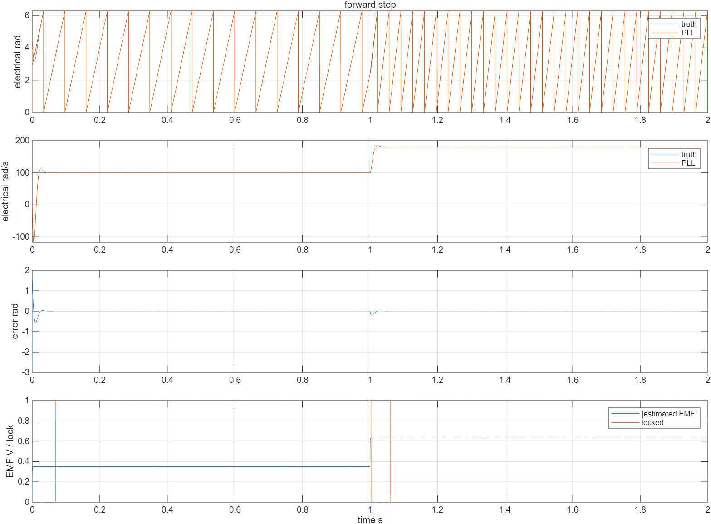
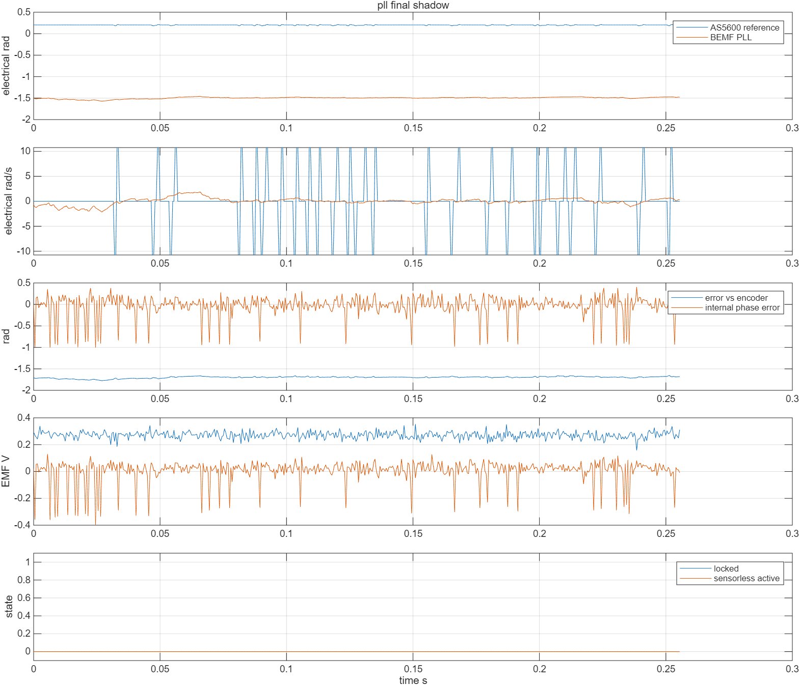

# 2026-10-06 反电势 PLL 调试记录

结论：**同一份 C 估算器在 MATLAB/Simulink 中通过验证；F407 实机未达到可靠锁定门槛，未切换到 PLL 反馈，未实现无编码器启动。** 最终手动启动的 0.10 A 编码器电流控制也没有重复得到早期的稳定旋转，需要先恢复可重复的编码器 FOC 基线。

工作分支 `test/pll`，开始时基线为 `1edb132`。本次没有推送远端，没有调整实物接线。最终硬件已停车：`MOTOR_EN=0`、`TIM8.MOE=0`、wrapper 输出关闭、实验故障因人工停止而锁存。不是把电机留在持续运转状态。

## 1. 环境和已保存的原始固件

| 项目 | 本次情况 |
| --- | --- |
| 开发机 | Debian 13，`bgzerol@develop.home.arpa` |
| 仓库 | `/home/bgzerol/embedded_project/foc_v3p` |
| 控制板 | FOC V3Plus，STM32F407，DAPLink CMSIS-DAP |
| 电机 | 2804，7 极对 |
| 母线/参考编码器 | 12 V、AS5600 |
| Windows USBIP 设备 | busid `1-9`，本次已连接到 VM |
| 仿真 | 本机 MATLAB/Simulink R2025b，现有 MinGW |

用户提示原有固件可能来自 `foc_test`。开始时运行中的 Flash 与当前仓库既有 ELF/新编译基线均不匹配，不能把旧 ELF 的 RAM 符号读数当作可信基线；没有确认原 Flash 的源码出处。

烧录前通过 OpenOCD 完整备份了芯片报告的 512 KiB Flash：

- 开发机：`build/pll-backup/original_flash.bin`
- 本机：`C:\Users\16004\Desktop\PLL锁相环测试\results\original_flash.bin`
- SHA256：`ac077b76284a13ca9db4d85cc7a84f3a82590f64a63eaff46f31aaabf3c23bf0`

备份保留在 `build/` 和本机实验目录，不作为源码提交。需要恢复时，退出已有 OpenOCD，在开发机仓库根目录运行：

```bash
openocd -f interface/cmsis-dap.cfg -f target/stm32f4x.cfg \
  -c 'adapter speed 1000' \
  -c 'program build/pll-backup/original_flash.bin 0x08000000 verify reset exit'
```

**恢复原固件后可能像最初一样自动运转**，恢复前先切断电机母线或确保可以立即断电。恢复命令只供需要回到原状态时使用，本次没有恢复。

## 2. MATLAB 和 Simulink 验证

最终版本重新编译 MEX 并实际执行，结果见 [`scripts/pll/results/summary.csv`](../../scripts/pll/results/summary.csv)：

| 场景 | 角度 RMS / rad | 速度 RMS / rad/s | 锁定比例 |
| --- | ---: | ---: | ---: |
| 正转 100→180 rad/s | 0.00013587 | 0.0023865 | 1 |
| 反转 −100→−180 rad/s | 0.00013574 | 0.0020295 | 1 |
| 电流/电压噪声 | 0.0025875 | 0.29734 | 1 |
| 估算器 R +20% | 0.17271 | 0.0024194 | 1 |
| 估算器 L +20% | 0.00016419 | 0.0024416 | 1 |
| 10 rad/s 低速 | 无有效点 | 无有效点 | 0 |
| 1 s 后反电势消失 | 停转前有效窗 0.00009344 | 停转前有效窗 0.0026571 | 全统计窗 0.48148 |

R 失配时约 9.9° 的角度偏差仍能内部锁定，这是不能只看 `locked` 的直接例子。失电势场景末段确实未锁定，表中的比例包含前半段转动时间。



噪声输入下自然频率 60/200/500 rad/s 对应末段速度噪声标准差约 0.03056/0.20835/0.84881 rad/s。板上因此选择 60 rad/s，但这只是在相同模型下的噪声取舍，没有解决实机偏差。

实际生成并运行了 [`sensorless_pll_learning.slx`](../../scripts/pll/sensorless_pll_learning.slx)。模型通过 S-Function/MEX 调用同一固件 C 源码，终点速度约 180 rad/s 且锁定。输入为解析电机电压/电流轨迹，没有模拟功率桥或机械闭环；详细复现与学习步骤见 [教程第 6 节](学习教程.md#6-本机-matlab可以从这里开始)。

## 3. 板上过程与数据

每份 CSV 是 512 行、每 10 个控制样本记录一次，正常 20 kHz 时覆盖约 0.256 s。以下速度均为电角速度；角度误差已 wrap 到 ±π。各次试验并非同一速度，不能把表格当作严格控制变量的性能排名。

| 文件前缀 | 变化/现象 | 角度 RMS / rad | 编码器 / PLL 均速 rad/s | 锁定比例 |
| --- | --- | ---: | ---: | ---: |
| `pll_shadow_01` | 早期 Debug，实际约 100 μs 一步 | 0.23313 | 323.35 / 646.34 | 0 |
| `pll_shadow_02` | 部分实时路径优化，仍有周期遗漏 | 0.38120 | 92.20 / 102.57 | 0 |
| `pll_shadow_release_01` | PLLRelease，20 kHz；PLL 自然频率 200 | 0.48849 | 72.76 / 58.84 | 0 |
| `pll_shadow_bw60_map0` | PLL 自然频率 60，原映射 | 0.34285 | 81.27 / 70.61 | 0 |
| `pll_shadow_bw60_map1` | 仅观测器交换 A/C | 0.36544 | 76.40 / 56.26 | 0 |
| `pll_shadow_pi15_map0` | 临时 PI 积分限幅 1.5 V，电机近乎停转 | 1.6385 | −0.000084 / −0.00170 | 0 |
| `pll_shadow_pi15_map0_later` | 上一次试验稍后的记录 | 1.6463 | 0 / 0.00474 | 0.03320 |
| `pll_final_shadow` | 恢复原 PI、手动启动、加速度门槛，仍近乎停转 | 1.69849 | −0.000168 / 0.00990 | 0 |

所有记录的 `active_fraction=0`，没有无感接管。本次没有把诊断用 A/C 交换固化为接线修改，最终映射是原配置 0。

数据、JSON、MATLAB 摘要/图片和 RTT 日志都保存在 [`results/hardware/`](results/hardware/)。没有保存失败生成的空 CSV 作为有效结果。

### 校准触发修复

当前项目一开始无法完成零偏校准，ADC 校准计数不增加。TIM8 CC4 的 ADC 触发链在实际配置下受 MOE 影响。启动 PWM 后清除 MOE，导致 ADC 注入转换停止。修复为校准阶段 `MOTOR_EN=0`、保持中性 PWM 和 MOE。校准完成、既有静态对齐和初始化流程才继续。

该行为在本板实际得到验证；不能只根据 TIM8 计数器仍在跑就认定 ADC 也在采样。最终代码默认初始化结束后关闭持续运行，手动 `request=3` 才请求 0.10 A 编码器运行。

### 优化解决了时基错误，没有解决角度质量

早期高速环测量最大耗时约 76.43 μs，超过 50 μs；控制样本实际约每 100 μs 才执行一次。估算器仍按 50 μs 计算，出现“PLL 均速约为编码器的两倍”。之后优化核心、wrapper、ADC、时间戳与队列路径，并采用 PLLRelease，记录中的正常步长恢复约 50 μs。

最终配置 JSON：

```text
last_period_us = 50
max_period_us = 53
missed_periods = 0
max_step_cycles = 2219  → 13.2083 μs
max_loop_cycles = 7088  → 42.1905 μs
```

最终人工停止时累计约 160713 个估算样本，没有超过 75 μs 的周期记录。DWT 换算使用 168 MHz。

`max_step_cycles` 包括估算器、实验条件和缓冲记录；`max_loop_cycles` 从 `SguanFOC_High_Loop()` 前开始，到新增处理后结束，**不含 ADC IRQ 入口/HAL 前后开销，也不含其后的快照发布**。因此 42.19 μs 不是完整 ISR 的最坏执行时间证明，短时间无遗漏也不能证明长期全工况没有超时。

### PI 限幅实验未改善，已恢复

保持 0.10 A 目标、1.5 V 输出限幅，短暂将积分限幅从 0.3 V 改为 1.5 V，原意是观察反电势信噪比。实际电机近乎停转，估算器仍形成约 1.3 V 的静态模型残差，并一度有 3.3% 的内部锁定点。没有发生无感接管。

这一结果不能证明实物产生了 1.3 V 旋转反电势；在编码器几乎不动时，它应被视为错误模型/输入产生的残差。最终恢复积分限幅 0.3 V，并加上指定转向速度至少 30 rad/s 才能内部锁定的检查。最终数据不再显示内部锁定，但**基线旋转问题仍未解决**。

### 最终波形



最终参考均速接近 0，PLL 均速也接近 0，但瞬时速度噪声使 RMS 速度差仍为 4.78 rad/s；估计向量幅值均值约 0.284 V、角度偏差约 −1.698 rad，不能解释成正常旋转时的锁相性能。

## 4. 停车状态与保留固件

最终发出停止请求后实际读取 GPIO/TIM8：

```text
MOTOR_EN = false
TIM8_BDTR = 8192 = 0x2000 → MOE(bit 15) = 0
motor_instance.output_enabled_ = 0
motor_instance.state_ = 4 (FAULT)
pll_experiment.active = 0
pll_experiment.fault = 1 (本次为人工停止锁存)
```

完整读取见 [`pll_final_stop_status.json`](results/hardware/pll_final_stop_status.json)。`last_result_=9` 是该实验停止路径沿用的 `SENSOR_ERROR` 通用结果码，不代表这次停车一定由 AS5600 故障引起；编码器超时诊断字段为 0。backend 的旧状态枚举可能尚未反映关闭，但硬件使能寄存器和 wrapper 输出已关闭。

保留在板上的最终 PLLRelease 有效镜像 SHA256：

```text
project.bin
c109d1ff951a3b51f9176149a2c48fd22a63eb94d003fc9f954dfcb37c1eb040

project.elf
16779e704a1dce872bdc802ace3c8e0e2d8b065856d2d5db70c0c7de0dfee3d2
```

RAM 使用约 65592 字节，其中采集缓冲 32768 字节；Flash 链接占用约 65400 字节。源码提交之后重新构建的哈希可能因路径/工具链不同变化，以同次构建的 ELF/BIN 配对和 Flash verify 为准。

本机保存最终 ELF/BIN 供归档，开发机 `build/PLLRelease/` 保留实际构建。默认上电仍有既有短时静态对齐动作，然后待机。停止锁存不会自动恢复运行。

## 5. 最终检查与限制

- 新增 C 主机测试 2/2 通过：算法正反转、速度阶跃、角度跨界、非法输入/配置、静止误锁；实验门槛、满足条件后的反馈、反电势丢失、周期超时、人工停止、10 秒上限、诊断映射禁止接管。
- 原有 `foc_math_test` 通过。原有 `foc_monitor_test`、`foc_control_test` 无法编译：引用不存在的 `drivers/foc/foc_core.h`，且现有 current_sensor 接口有 `-Werror` 未使用参数错误。相关文件本次未修改，不能报告原测试全通过，也不能用这些测试证明 STM32 wrapper 的实机行为。
- Debug、Release、PLLRelease 均成功构建。最终板上使用 PLLRelease。
- MATLAB 七种场景、自然频率对照、Simulink 实际运行与终点断言通过。
- RTT 实际连接读取成功，日志保留。RTT 使用非阻塞输出，丢日志不会阻塞电流 ISR。
- 没有拔掉 AS5600 验证，没有无感接管，没有无感冷启动，没有验证整个速度/负载范围，也没有完成真实 R/L 辨识或示波器确认电压/电流映射。

后续优先级：先让原有编码器 FOC 能重复稳定启动，核对电流物理对应、角度对齐与 PWM/ADC 时序，再验证模型参数和电压重建，最后才进入无感接管。这个仓库已留下可复现的仿真、板上采集和判断工具，下一轮可以沿着同一套证据继续。
