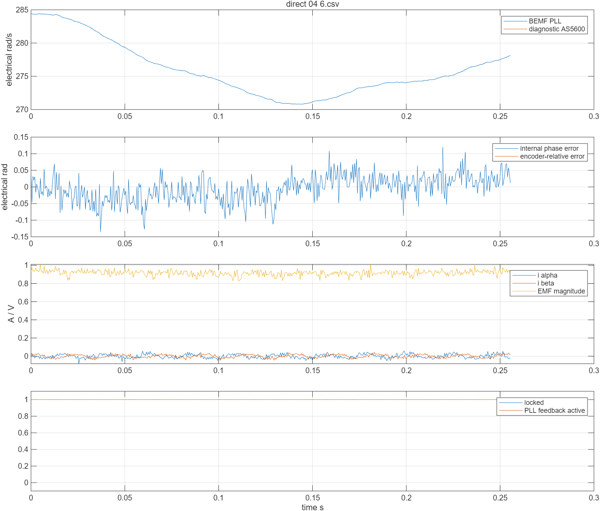
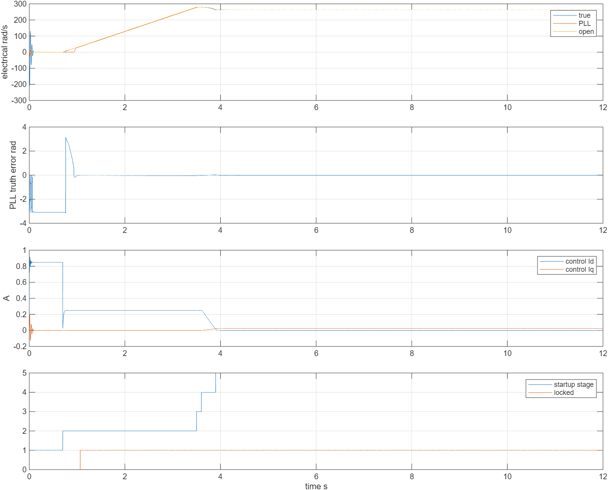

# 直接无感 PLL：从静止启动到本板实机验证

本轮在 `test/pll` 完成了 2804 / 7 极对电机、FOC V3Plus、STM32F407、12 V 母线的**直接无感启动和短时闭环**。流程为 3 V 定位、开环电流加速、反电势观测器锁定、平滑切换至 PLL 角度。两次关闭 AS5600 采样的试验仍完成了 10 s PLL 反馈窗口，其中约 0.3 s 是过渡、9.7 s 是全 PLL 角度反馈。输出最终已关断。

AS5600 仍物理连接并由驱动板供电；本轮证明的是**从启动前到停车不读取编码器数据，控制不依赖它**。尚未做物理拔掉编码器、加载、反转、多转速及长时间连续运行。本固件保留实验时限。

先看本篇，再看 [基础学习教程](学习教程.md) 第 1～6 节。早期文档中的“尚未接管”和 6 s 正反编码器对齐是历史事实；当前默认启动方式已经改变。

## 1. 无感为什么也要先开环启动

反电势随转速产生；静止时没有足够反电势，PLL 无法凭空知道转子角度。先用固定磁场拉住转子，再让定子电流向量慢慢转动，电机跟上后才有可估计的反电势，然后切到闭环。这种开环加速再切闭环的过程亦见 [Microchip AN2590 启动说明](https://onlinedocs.microchip.com/oxy/GUID-94F279C6-1342-4E97-B4A0-AEBFA48CEF3D-en-US-3/GUID-CB77DB0A-ED00-4078-A3CB-74461D7552C7.html)。

`pll_startup.c` 没有编码器输入。它只接收观测器状态和母线电压，输出控制角度、速度、Id/Iq 目标。Sguan 中保留的 `encoder.Real_Espeed` 名字在直接模式里装的是控制用估算速度，不能把这个名字当作有感控制证据。

速度默认使用**电角速度 rad/s**。7 极对下：

\[
\omega_m=\omega_e/7,\qquad \mathrm{rpm}=\omega_e\,60/(2\pi\,7).
\]

目标 280 rad/s 电角速度对应 40 rad/s 机械速度，约 382 rpm。

## 2. 关键修正：电流相序与极性

最初直接启动虽然能转，PLL 内部误差在稳态约 0.19 rad，不能连续锁定。定位时仍出现约 2 V 的“反电势残差”，而静止稳态的电压主要应为电阻压降，这提示电压和电流的坐标没有对齐。

于是用 0°、60°、120°、180°、240°、300° 六个固定的 **3 V 定子电压向量**，每个保持 0.7 s。用后半段数据拟合“电压 α/β → 两路按原配置符号处理的 ADC 电流”。ADC0 的响应轴约 61°，对应 −C；ADC1 的响应轴约 117°，对应 B（这一路原配置已经乘 −1）。最终相对于原始 ADC 的正确逻辑映射为：

| ADC 通道（减零点后） | 逻辑相电流 |
|---|---|
| ADC0 | C，方向 −1 |
| ADC1 | B，方向 −1 |
| 未采样 A | A = −B − C |

生产驱动新增 `CB` 映射，板配置为 `CB, -1, -1`。Clarke 使用重建后的相：

\[
i_\alpha=i_A,\qquad i_\beta=(i_A+2i_B)/\sqrt3.
\]

修正前，两路原配置电流的拟合为：

```text
[m0]   [ 0.14034  0.25319] [vα]
[m1] = [-0.12659  0.24629] [vβ]    单位 A/V
```

修正后，Clarke 电流对电压的拟合接近对角：

```text
[iα]   [0.26677  0.00966] [vα]
[iβ] = [0.00742  0.28750] [vβ]    单位 A/V
```

这里矩阵按 `static_vectors_*_fit.json` 最小二乘数组转置展示；保存的数组第一维为 vα/vβ，第二维为输出。修正后各轴残差 RMS 约 0.0192 A、0.0115 A。对角电导对应约 3.75 Ω、3.48 Ω；实验取两路有效响应折中的 **R = 3.53 Ω**，L 沿用 0.86 mH。

R 是本板 PWM、电机及当前电流比例下的有效参数。增益 50、采样电阻 0.01 Ω 沿用原配置，未用独立仪表校准绝对电流，也未独立测 L，不能当作精密绕组测量。早期错误相序重建出的相电流峰值不能与修正后直接比较。通用 `bemf_pll_default_config()` 仍为 R = 2.55 Ω，板上 `pll_experiment_init()` 明确覆盖为 3.53 Ω。

## 3. 启动状态机逐步解释

控制周期为 50 µs，20 kHz。

| 值 | 状态 | 行为和结束条件 |
|---|---|---|
| 0 | IDLE | 初始化、校准后待机，显式请求才启动 |
| 1 | ALIGN | 固定 3 V 向量定位 0.7 s，重置电流 PI |
| 2 | RAMP | 开环角度以 100 rad/s² 加速到 280 rad/s，约 2.8 s |
| 3 | WAIT | 维持开环速度，连续 100 ms 合格才切换，最多等 2 s |
| 4 | BLEND | 0.3 s 平滑移到 PLL 角度，启动 Id 逐渐降为 0 |
| 5 | CLOSED | 完全用 PLL 角度和速度，含过渡共最多 10 s |
| 6 | FAULT | 结束或异常，关驱动/PWM，关断状态复位后才可再试 |

3 V 是 PWM 合成的定子电压向量幅值，母线仍为 12 V。开环加速的 **Id = 0.25 A、Iq = 0** 使用的是**人为旋转的开环坐标**，不能理解成已知转子 d 轴上的纯励磁电流；转子以负载角跟随旋转磁场并产生转矩。这个启动目标比先前 0.0几 A 更容易跨过摩擦。

WAIT 门槛全部来自无感状态：观测器 valid、locked、正向、反电势 > 0.15 V，PLL 下一拍角度与开环下一拍角度误差 < 0.35 rad，速度差 < 开环速度的 25%，连续 2000 拍。**不再用 AS5600 误差决定是否接管。**

BLEND 中开环时钟跟随 PLL 速度推进，避免两个时钟持续漂移造成跨 π 插值跳变。闭环角度用 PLL 预测下一拍角度。q 电流目标为：

```text
Iq = clip(0.020 + 0.002 × (280 − PLL电角速度) / 7, 0, 0.10) A
```

这是轻载实验的有界速度修正。闭环维持旋转通常只需约 0.02 A，**起步来自前面的 3 V 定位与 0.25 A 开环电流**，不能拿闭环轻载 Iq 推断起步力矩。

板上观测器 R = 3.53 Ω、L = 0.86 mH、wn = 6000 rad/s、ζ = 1，PLL wn = 60 rad/s、ζ ≈ 0.707。反电势观测及 PLL 原理见 [基础教程](学习教程.md) 和 [Microchip PLL 无感 FOC 应用笔记](https://www.microchip.com/en-us/application-notes/an1292)。

## 4. 保护与停止原因

相电流 1.8 A 限制始终有效。定位及加速前 100 ms 暂不应用旧 d/q 0.5 A 门槛，之后恢复。母线要求 10～14 V；无效数值、闭环失锁/无效估算、估算速度 < 30 rad/s 会停止。控制周期间隔超过 75 µs 也会停止；执行耗时另外记录，不能把“周期间隔”和“执行时间”混淆。

PLL 反馈计数包括 BLEND，200000 拍即 10 s 结束；另有 360000 拍总时限与独立任务 18 s HAL 墙钟监控。主机脚本最终请求停车，再次清 MOTOR_EN / TIM8.MOE。结束后的 `fault=1` / FAULT 不必然是调试失败，要结合 reason：

| reason | 含义 |
|---|---|
| 0 | 无停止原因 |
| 1 | 母线不合格 |
| 2 | 等锁定超时 |
| 3 | 接管后失锁或估算无效 |
| 4 | 实验计数时限到达（本轮成功记录为此项） |
| 5 | 请求停车（含任务墙钟超时关断） |
| 6 | 控制周期间隔超限 |
| 7 | 电流/控制器等硬件链路故障 |
| 8 | 六角度静态诊断正常完成 |

保留第一次停止原因，脚本随后停车不会覆盖。原因 7 需结合 wrapper 的其他状态、电流继续追查。本轮没有取消时限长时间运行。

## 5. 实机数据与判断依据

数据在 `results/hardware/direct/`。JSON 含启动前、时间线、自动停车前和最终输出；CSV 每 10 控制拍保存一行，512 行窗口、2 kHz、256 ms。各窗分离，不能当作完整连续波形。静态扫描每 200 拍取样，420 行，是正常完成后冻结的部分缓冲。

| 记录 | 编码器 | 结果 | 最大相电流 | 最长执行时间 |
|---|---|---|---|---|
| direct_01 | 仅诊断 | 错映射，未锁定；reason 2 停机 | 旧映射，不作真实值比较 | 42.13 µs |
| static_vectors_01/02 | 仅诊断 | 六角度拟合与复核 CB / 双负号 | 静态诊断 | 43.81 µs（02） |
| direct_02 | 仅诊断 | 接管成功，PLL 反馈 10 s | 0.930 A | 43.88 µs |
| direct_03 | 启动前禁用采样 | 接管成功，PLL 反馈 10 s | 0.916 A | 43.52 µs |
| direct_04 | 禁用采样，RTT 同时记录 | 重复接管成功，PLL 反馈 10 s | 0.892 A | 43.45 µs |

03 的 `rotor.sequence` 从启动前到停车一直为 **9492**，04 一直为 **8774**。两次 `pll_encoder_diagnostics_enabled=0`，CSV 编码器角度/速度为 NaN，仍完成完整启动链路。02 的 AS5600 只作诊断，稳态相对角度 RMS 约 0.128～0.149 rad；参考延时和零点精度未独立验证，不能当作绝对角度标定。

成功案例闭环的已采集窗口 locked/active 均为 1，估算电角速度约 280 rad/s，反电势约 0.95 V。03 内部相位误差窗口 RMS 约 0.034～0.039 rad。**内部锁定不是独立真实角度测量**；要结合电流、运行计数、02 诊断参考和停车结果。03/04 没有真实角度参考。

03/04 均 `active_samples=closed_ticks=200000`，最终 reason 4；全 PLL 阶段计数 193999 拍，约 9.70 s。最长采样周期 53 µs、漏周期 0。04 最终状态见 [final_stop_status.json](results/hardware/direct/final_stop_status.json)：驱动关闭，TIM8_BDTR 的 MOE 位清零，active=0。



RTT 为 10 Hz 非阻塞输出，含 ref_valid、stage、reason、locked、active。03 首次读取获得空字节，只在本机保留为失败日志。固定到 ELF 的控制块地址、停止旧轮询后，04 得到有效文本 `direct_04_rtt.log`。旧缓冲可能含此前待机文本，按 ms/seq/stage 对照 JSON。RTT 不能替代高速冻结缓冲。

## 6. MATLAB 全流程与结果

使用本机已安装 MATLAB 与现有 MinGW，没有安装或更改系统工具。MATLAB 提示该 MinGW 版本不在支持列表，但本次 MEX 实际编译成功且断言通过。

在 MATLAB 切到仓库 `scripts/pll`：

```matlab
setenv('MW_MINGW64_LOC','C:\software\mingw64')
run_direct_start_simulation
analyze_direct_cases('../../docs/pll/results/hardware/direct')
```

第一条将同份 `pll_startup.c`、`bemf_pll.c`、生产 PI/math C 编译为 MEX，在理想 PMSM 机械模型里每 50 µs 运行一次。生成 `results/direct_start_simulation.csv` 与 PNG，CSV 是完整 12 s 波形、1 kHz 保存。Git 忽略完整 CSV 和编译文件，本机已保留，可重生成。

先看 stage 列找到定位、加速、等待、过渡和全 PLL 阶段；再比较 true_speed 与 pll_speed；最后用 `atan2(sin(PLL角度−真实角度),cos(...))` 得到环绕后的真实角度误差。仿真有真实角度，禁用编码器的实板 CSV 没有这个独立参考。

| 仿真假设 | 值 |
|---|---|
| R / L / 磁链 / 极对 | 3.53 Ω / 0.86 mH / 0.0035 Wb / 7 |
| 母线 / 向量电压上限 | 12 V / 3 V |
| 惯量 J | 5×10⁻⁶ kg·m²（假设） |
| 库仑摩擦 / 粘性系数 | 6×10⁻⁴ N·m / 8×10⁻⁶ N·m·s（假设） |
| 初始电角度 / 速度 | 1.3 rad / 0 |

这不是整板数字孪生：J、摩擦、磁链未实测，未加 PWM 死区、ADC 误差及电流带通滤波，机械积分/逆变器也简化。它验证这些假设下相同启动/PLL C 算法能交接，不能替代实机。

本次 12 s 仿真中全 PLL 阶段 **8.101 s**，真实电角度误差 RMS **0.01329 rad**，最大相电流 **0.914 A**。断言检查确实进入闭环、闭环最大角度误差 < 0.2 rad、峰值电流 ≤ 1.8 A。进入闭环约在 3.9 s，所以仿真的 8.101 s 不等于板上 10 s 试验时限。



第二条逐窗生成实机图和 `direct_summary.csv`。从上到下看速度、内部/参考角度误差、电流/反电势、锁定/接管状态；禁用编码器后参考曲线为空是预期结果。

原电气七场景及 Simulink 流程仍可按基础教程运行：

```matlab
run_pll_simulation
build_simulink_demo
open_system('sensorless_pll_learning.slx')
```

原模型默认 R = 2.55 Ω，是观测器学习模型，未加入新增机械启动状态机。新启动实验用上述 MEX 脚本。

## 7. Debian 构建与实机复现

在 `/home/bgzerol/embedded_project/foc_v3p`：

```bash
git branch --show-current  # test/pll
cmake --preset PLLRelease
cmake --build --preset PLLRelease
cmake -S tests/pll -B build/tests-pll -G Ninja
cmake --build build/tests-pll
ctest --test-dir build/tests-pll --output-on-failure
```

`PLLRelease` 为 Release `-O2 -g3`，保留符号，开启 RTT / PLL_DIRECT_SENSORLESS，关闭编码器自动运行。当前 **7 项通过**：基础 PLL、实验守卫、I²C 总线清除、SVPWM 物理电压、独立 d/q PI、直接启动边界及编码器输入不影响控制、生产 ADC 零点与 CB 映射。

USBIP / DAPLink / OpenOCD 操作沿用基础教程。开发机已连接 Windows usbipd bus 1-9，OpenOCD 提供 Tcl 6666 / GDB 3333；已有进程时不要再启动第二个抢探针。重新连接可用 `sudo usbip attach -r <Windows实际地址> -b 1-9`。

烧录前**先关输出，再暂停 CPU**。OpenOCD Tcl 依次执行：

```text
write_memory 0x40021018 32 {2097152}
mmw 0x40010444 0 0x8000
rtt stop
halt
program build/PLLRelease/project.elf verify
reset run
```

第一条拉低 GPIOE PE5 MOTOR_EN，第二条清 TIM8 MOE。初始化 ADC 校准需要 TIM8 触发，中性 PWM 可有 MOE，但 MOTOR_EN 保持低；不能只看 MOE=1 就判断驱动已开启。转动时不要断点或 halt。

复位后等约 2 s，核对状态再开始：

```bash
python3 scripts/pll/board_status.py
python3 scripts/pll/run_direct_case.py --output build/direct_case --no-encoder
python3 scripts/pll/board_status.py
```

脚本核对整份 Flash 与 ELF 配套 BIN，再要求直接模式 READY、fault=0、MOTOR_EN=0；启动前禁用诊断采样，请求 4，下载多窗，最终确认输出关断。脚本不复位、不烧录。结束进入实验 FAULT，下一轮需关断状态复位。

同一次初始化后同步 RTT：

```bash
python3 scripts/pll/read_rtt.py --seconds 22 --output build/direct_rtt.log > build/direct_rtt_console.log 2>&1 &
rtt_pid=$!
python3 scripts/pll/run_direct_case.py --output build/direct_case --no-encoder
wait "$rtt_pid"
```

读取器从匹配 ELF 解析 RTT 地址并验证 SRAM 标识；空/NUL 日志报错。请求 5 为六向量静态诊断，脚本 `run_static_vectors.py --output build/static_vectors`；请求 2 停车，脚本 `capture_board.py --stop`。旧请求 1/3 和旁路映射仅用于有感历史模式，当前脚本拒绝直接模式下这些动作。

## 8. MCU 热复位与编码器持续供电

MCU 热复位不会让 AS5600 断电，I²C 事务中途复位可能遗留总线状态。前轮已加入开漏 SCL 脉冲、STOP、外设重初始化，详见 [历史排查](3V启动与编码器复位排查.md)。直接模式不等待 AS 初始化，不因 AS 无数据阻塞启动；诊断任务独立尝试初始化，禁用后不读角度。

04 初始化 `recovery_attempts=1`、`recovery_failures=0`、编码器错误计数 0，说明这一轮初始化正常，不代表每种拔插/故障时序已验证。热复位排查应在输出关闭时进行，观察线状态、恢复计数和采样序号。

## 9. 文件及版本对应

- 状态机：`user_lib/drivers/foc/sensorless/pll_startup.{h,c}`；观测器及板参数：同目录 `bemf_pll.c` / `pll_experiment.c`。
- 板配置：`user_lib/devices/foc_dev.cpp`；CB 实现：`stm32_two_shunt_current_sensor.{h,cpp}`。
- 控制集成：`SguanFOC.c` / `wrapper/sguan_foc_wrapper.cpp`；RTT：`user_lib/debug/pll_rtt.cpp`。
- 原始 CSV/JSON、拟合、有效 RTT、摘要和图：`docs/pll/results/hardware/direct/`。
- 每次 ELF/BIN 的大小与 SHA256：其中 `firmware_sha256.json`；源文件 SHA256：`docs/pll/source_sha256_direct.json`。
- 本机保留完整仿真 CSV、日志及各次 ELF/BIN 归档；提交归档含源码、文档、实机记录与仿真摘要/图。

若后续扩展负载和速度范围，先校准电流比例、测 R/L/磁链，再验证启动参数与失锁处理。本次保留已实测的短时边界。
