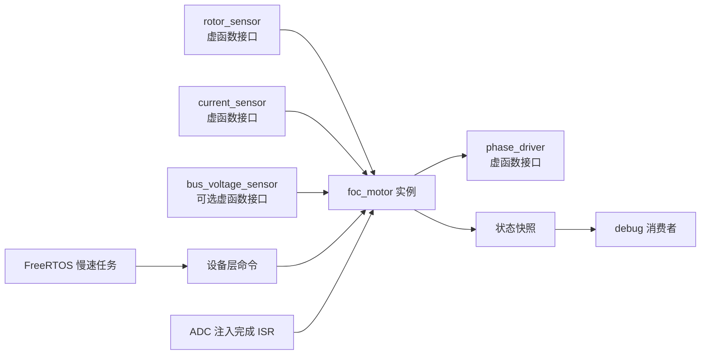

# 自研 FOC 库架构设计评估

> 日期：2026-08-12  
> 目标工程：STM32F407 + CMake + C++17 + FreeRTOS  
> 参考版本：`SguanFOC库v3.0.0(有感foc，浮点运算，初阶)`  
> 本报告只做架构评估，不表示现阶段代码已经具备安全驱动电机的条件。

## 1. 结论

适合参考 SguanFOC 3.0.0 的算法顺序和高低频分层，但不建议直接把它翻译成 C++。自研库应以 `foc_motor` 对象为核心，把控制器、滤波器、计数器、校准值、状态和故障全部放入对象成员，从结构上保证多实例。

建议满足以下约束：

1. 库全部位于 `user_lib/drivers/foc/`，由 `.h/.cpp` 构成。
2. 一台电机对应一个 `foc_motor` 实例，不使用全局唯一电机对象。
3. 转子位置传感器、电流传感器和三相 PWM 驱动通过 `link_*()` 绑定抽象接口。
4. 抽象接口使用虚函数，但不使用堆分配、RTTI、异常或运行时容器。
5. 虚函数只放在硬件边界；Clarke、Park、PI、SVPWM 等核心数学路径保持普通成员函数或静态函数。
6. 高频电流环由 PWM 同步 ADC 注入完成中断驱动，不能由普通 FreeRTOS 任务定时。
7. FreeRTOS 只负责命令、状态、调试和慢速管理，不能在高频环中等待 Mutex、Semaphore、Queue 或 DMA 完成。
8. 第一版先完成有感电压模式和电流环，不一开始移植 LADRC、复杂状态机、MTPA 和通信协议。

总体关系建议如下：



这里的 `link` 是依赖注入，不是让 `foc_motor` 拥有传感器。对象只保存非拥有型指针，实际传感器和驱动对象应具有静态生命周期。

## 2. SguanFOC 3.0.0 的核心路径

本次只参考以下源码快照，不混入 3.0.1 的 Q31 路径和 3.1.0 的无感路径：

- [`SguanFOC.c`](<../../SguanFOC_Library/SguanFOC库v3.0.0(有感foc，浮点运算，初阶)/SguanFOC.c>)
- [`SguanFOC.h`](<../../SguanFOC_Library/SguanFOC库v3.0.0(有感foc，浮点运算，初阶)/SguanFOC.h>)
- [`Sguan_math.c`](<../../SguanFOC_Library/SguanFOC库v3.0.0(有感foc，浮点运算，初阶)/Sguan_math.c>)
- [`Sguan_PID.c`](<../../SguanFOC_Library/SguanFOC库v3.0.0(有感foc，浮点运算，初阶)/Sguan_PID.c>)
- [`Sguan_PLL.c`](<../../SguanFOC_Library/SguanFOC库v3.0.0(有感foc，浮点运算，初阶)/Sguan_PLL.c>)

### 2.1 调度入口

参考库由四个入口驱动：

| 入口 | 建议频率 | 职责 |
|---|---:|---|
| `SguanFOC_High_Loop()` | 10 kHz 或更高，默认参数对应 20 kHz | 采样、坐标变换、闭环、SVPWM |
| `SguanFOC_Low_Loop()` | 1 kHz 或更低 | 电压、温度、状态和故障管理 |
| `SguanFOC_main_Loop()` | 主循环 | 初始化、校准和遥测 |
| `SguanFOC_Printf_Loop()` | 通信接收时 | 在线参数处理 |

高频核心链路为：

```text
读取机械角
    → 角度偏置与方向修正
    → PLL 估计机械角速度和连续机械角
    → 极对数换算电角度
    → sin/cos
    → 读取两相电流并重构第三相
    → Clarke
    → Park
    → Id/Iq 滤波
    → 按模式运行电流/速度/位置控制器
    → D/Q 解耦前馈
    → Ud/Uq 归一化
    → 逆 Park + SVPWM
    → 写入三相 PWM
```

这个顺序可以作为第一版自研库的算法骨架。

### 2.2 值得保留的思想

- 高频采样、控制和调制放在同一条确定性路径中。
- 电流环、速度环和位置环采用不同更新倍率。
- 编码器机械角经过方向和零偏校正后再转换为电角度。
- 两电阻电流采样重构三相电流，再做 Clarke/Park。
- D/Q 电流 PI 输出叠加交叉耦合和反电动势前馈。
- 输出进入 SVPWM 前限制电压矢量幅值。
- 初始化、慢速保护、通信和高频控制分开。

### 2.3 不适合直接照搬的部分

参考库只有全局 `Sguan` 一个实例。虽然许多内部函数接受结构体指针，但下面的状态仍由所有潜在实例共享：

- `Control_VelCur_DOUBLE()` 内的静态外环计数器。
- `Control_PosVelCur_THREE()` 内的静态外环计数器。
- `PID_Loop()` 内的静态积分冻结标志。
- 状态机、PWM 看门狗和调试输出内的多个静态计数器。
- `UserData_*.h` 中直接访问全局 `Sguan` 的硬件钩子。

尤其是 PID 的积分冻结标志不仅影响多台电机，同一台电机的 D 轴、Q 轴、速度和位置控制器之间也会相互干扰。自研实现中所有可变状态必须属于具体控制器或具体电机对象。

参考库还存在以下设计风险，自研时应主动规避：

- 状态编号通过 `< 4`、`< 19` 等数字范围表达语义，容易在扩展状态时失效。
- 软件置零电压矢量不等于关闭门极，不能替代硬件 Break 和驱动器 Enable。
- 过流判断没有完整覆盖负向大电流。
- 初始化包含较长阻塞延时，不适合直接塞进实时调度入口。
- `User_UserControl()` 和可选调试输出进入高频 ISR 路径，难以控制最坏执行时间。
- 保护用实测母线电压，而调制仍除以固定配置电压。
- “互斥标志”只能发现部分重入，不能证明高频环在周期预算内完成。

## 3. 建议目录结构

第一版不要过度拆分，但应让算法、接口和 STM32 硬件适配边界清晰：

```text
user_lib/drivers/foc/
├── foc_types.h
├── foc_math.h
├── foc_math.cpp
├── pi_controller.h
├── pi_controller.cpp
├── low_pass_filter.h
├── low_pass_filter.cpp
├── rotor_sensor.h
├── current_sensor.h
├── bus_voltage_sensor.h
├── phase_driver.h
├── foc_motor.h
├── foc_motor.cpp
└── stm32/
    ├── stm32_three_phase_driver.h
    ├── stm32_three_phase_driver.cpp
    ├── stm32_two_shunt_current_sensor.h
    └── stm32_two_shunt_current_sensor.cpp
```

AS5600 的 FOC 适配可以后续放在：

```text
user_lib/drivers/foc/sensors/as5600_rotor_sensor.h
user_lib/drivers/foc/sensors/as5600_rotor_sensor.cpp
```

应用层实例和任务不应放进库目录，建议放在：

```text
user_lib/devices/foc_dev.h
user_lib/devices/foc_dev.cpp
```

分层职责：

| 层 | 职责 |
|---|---|
| `drivers/foc` | 平台无关的 FOC 算法、控制器、抽象硬件接口 |
| `drivers/foc/stm32` | TIM、ADC、GPIO 等 STM32 HAL 适配 |
| `drivers/foc/sensors` | 具体位置传感器到 `rotor_sensor` 的适配 |
| `devices/foc_dev` | 创建 motor0/motor1，完成 link、启动和 ISR 分派 |
| `debug` | 读取低频快照并输出，不进入高频控制链 |

## 4. 多实例设计

### 4.1 一台电机一个完整对象

`foc_motor` 应拥有这台电机的全部算法状态：

```text
foc_motor
├── motor_config
├── control_config
├── safety_config
├── runtime_state
├── d_axis_pi
├── q_axis_pi
├── velocity_pi
├── position_pi
├── velocity_filter
├── rotor_pll
├── loop_dividers
├── calibration_state
├── fault_state
├── rotor_sensor*
├── current_sensor*
├── bus_voltage_sensor*
└── phase_driver*
```

禁止把下面这些内容写成函数内 `static` 或可变全局变量：

- PI 积分和抗饱和状态。
- 滤波历史数据。
- 上次角度、圈数和速度估计。
- 外环分频计数器。
- 电流零偏。
- 故障确认计数器。
- 运行状态和目标值。
- 上次控制耗时与超时计数。

只有只读常量和只读查表允许被所有实例共享。

### 4.2 不使用动态内存

对象建议静态创建：

```cpp
static stm32_three_phase_driver motor0_driver(/* TIM1 配置 */);
static stm32_two_shunt_current_sensor motor0_current(/* ADC1 配置 */);
static as5600_rotor_sensor motor0_rotor(/* I2C/缓存配置 */);
static foc_motor motor0(motor0_config);

static stm32_three_phase_driver motor1_driver(/* TIM8 配置 */);
static stm32_two_shunt_current_sensor motor1_current(/* ADC2 配置 */);
static as5600_rotor_sensor motor1_rotor(/* I2C/缓存配置 */);
static foc_motor motor1(motor1_config);
```

`foc_motor`、传感器和驱动类应删除复制和移动操作，防止已经 link 的对象地址变化。

### 4.3 多实例不等于可并发重入

motor0 和 motor1 拥有独立状态后，可以分别在 ADC1/ADC2 事件中运行。但必须保证同一个 `foc_motor` 实例不会同时被两个执行上下文调用。

双电机需要额外考虑：

- ADC1 与 ADC2 在 STM32F407 上共享 ADC 中断入口，需要根据硬件标志分派。
- TIM1 和 TIM8 同频同相启动时，两个控制 ISR 可能集中到同一时间窗口。
- 可以考虑将两个载波错开半周期，降低 CPU 峰值和母线采样干扰。
- 每个实例都要独立测量最坏执行时间，不能只看平均耗时。

## 5. link 与虚函数接口

### 5.1 为什么应按传感器种类拆接口

不建议设计一个万能 `sensor` 基类。转子角、电流、母线电压和温度的时序要求差异很大：

- 转子位置要求角度、速度、时间戳和方向语义。
- 相电流必须和 PWM 采样点同步，通常直接读取 ADC 注入结果。
- 母线电压变化较慢，但调制前必须有有效且非零的数据。
- 温度只需要慢速更新。

因此应分别定义小型接口，而不是依靠类型编号和 `void *`。

### 5.2 结果和样本类型

建议先建立明确的公共类型：

```cpp
enum class foc_result : uint8_t
{
    OK = 0,
    NOT_LINKED,
    NOT_INITIALIZED,
    INVALID_CONFIG,
    SAMPLE_NOT_READY,
    SAMPLE_STALE,
    SENSOR_FAULT,
    DRIVER_FAULT
};

struct rotor_sample
{
    uint32_t sequence = 0U;
    uint32_t timestamp_us = 0U;
    float mechanical_angle_rad = 0.0f;
    float mechanical_velocity_rad_s = 0.0f;
    bool valid = false;
};

struct phase_current_sample
{
    uint32_t sequence = 0U;
    uint32_t timestamp_us = 0U;
    float current_a = 0.0f;
    float current_b = 0.0f;
    float current_c = 0.0f;
    bool valid = false;
};
```

FOC 使用微秒级时基，不能继续把 FreeRTOS 的毫秒 tick 当作高频采样时间。

### 5.3 转子位置接口

```cpp
class rotor_sensor
{
    public:
        virtual ~rotor_sensor() = default;

    public:
        virtual foc_result init() = 0;

    public:
        virtual foc_result read_latest(rotor_sample &sample) = 0;
};
```

`read_latest()` 的契约必须写清楚：

- 不等待总线、DMA、Mutex、Semaphore 或 Queue。
- 如果在 ISR 中调用，具体实现必须保证 ISR 安全。
- 必须返回采样时间和有效性，FOC 核心负责判断是否过期。
- 角度统一为机械弧度，方向和零偏由传感器适配层或明确的电机配置处理，不能重复修正。

### 5.4 电流传感器接口

```cpp
class current_sensor
{
    public:
        virtual ~current_sensor() = default;

    public:
        virtual foc_result init() = 0;
        virtual foc_result calibrate() = 0;

    public:
        virtual foc_result read_latest(phase_current_sample &sample) = 0;
};
```

STM32 双电阻实现中，`read_latest()` 只应读取已经完成的 ADC 注入寄存器、减去偏置、应用增益并重构第三相。它不能在函数内启动 ADC 后等待转换。

电流零偏、相序、采样通道组合、增益和方向属于具体 `current_sensor` 实例，不属于全局 FOC 算法。

### 5.5 三相驱动接口

虽然需求只明确了传感器使用 link，但建议把 PWM 驱动也作为硬件边界绑定：

```cpp
class phase_driver
{
    public:
        virtual ~phase_driver() = default;

    public:
        virtual foc_result init() = 0;

    public:
        virtual foc_result enable() = 0;
        virtual void disable() = 0;
        virtual foc_result set_duty(float duty_a,
            float duty_b,
            float duty_c) = 0;
};
```

`disable()` 必须能执行真实的安全动作，例如关闭定时器主输出、拉低门极驱动 Enable 或同时执行两者。写入 50% 占空比的零电压矢量不能代替它。

### 5.6 foc_motor 的绑定接口

```cpp
class foc_motor
{
    public:
        explicit foc_motor(const foc_config &config);
        foc_motor(const foc_motor &) = delete;
        foc_motor &operator=(const foc_motor &) = delete;

    public:
        foc_result link_rotor_sensor(rotor_sensor &sensor);
        foc_result link_current_sensor(current_sensor &sensor);
        foc_result link_bus_voltage_sensor(bus_voltage_sensor &sensor);
        foc_result link_driver(phase_driver &driver);

    public:
        foc_result init();

    public:
        foc_result enable();
        void disable();
        foc_result run_current_loop_from_isr(uint32_t timestamp_us);
        foc_result run_motion_loop(uint32_t timestamp_us);
        void set_target(const foc_target &target);
        foc_snapshot snapshot() const;
};
```

推荐约束：

- link 只保存非拥有型指针，不调用硬件，不接管生命周期。
- 必须在 `init()` 前完成所有必需绑定。
- 初始化后禁止重新 link，除非先完整 `deinit()` 并处于禁能状态。
- `init()` 检查空指针、极对数、控制周期、母线电压、限幅和接口初始化结果。
- 任何必需依赖缺失都拒绝使能，不允许静默使用零值。

### 5.7 虚函数开销评估

虚函数在这里是可接受的，因为：

- 每个高频周期只需要少量硬件边界调用。
- STM32F407 使用 Cortex-M4F，主要浮点算法成本远高于一次间接函数调用。
- 当前 CMake 已启用 `-fno-rtti -fno-exceptions`，虚函数本身不依赖 RTTI 和异常。

但应遵守以下限制：

- 不把 Clarke、Park、PI、滤波器、限幅等每个小步骤都做成虚函数。
- 不使用 `dynamic_cast`、`typeid`、`new` 或 `delete`。
- 高频虚函数不能阻塞，也不能调用普通 FreeRTOS API。
- 实际完成后必须用 DWT 周期计数器测量 Debug 和 Release 的最坏耗时。

## 6. 建议的高频控制路径

第一版 `run_current_loop_from_isr()` 建议严格按下面顺序执行：

```text
1. 检查 motor 状态和硬件故障锁存
2. current_sensor.read_latest()
3. rotor_sensor.read_latest()
4. 检查 sample.valid、sequence 和 timestamp_us
5. 机械角 → 电角度，并补偿方向、零偏和必要的采样延迟
6. sin/cos
7. Clarke: Iabc → Iαβ
8. Park: Iαβ → Idq
9. 更新电流 PI
10. 可选加入 D/Q 解耦前馈
11. 根据实时母线电压限制 Udq 矢量
12. 逆 Park: Udq → Uαβ
13. SVPWM: Uαβ → duty_abc
14. phase_driver.set_duty()
15. 更新轻量统计；按分频产生调试快照
```

任何关键样本无效、过期、出现 NaN/Inf、母线电压过低或输出越界时，应立即：

```text
锁存 fault
    → phase_driver.disable()
    → 清空 PI 积分
    → 拒绝自动重新使能
```

不要在故障分支中打印串口。

## 7. 多速率环路

可以保留 SguanFOC 的多速率思想，但分频计数器必须属于 `foc_motor`：

| 路径 | 建议第一版位置 | 典型关系 |
|---|---|---|
| ADC、电流环、SVPWM | ADC 注入完成 ISR | 每次执行 |
| 速度估算 | ISR 或专用快速路径 | 每次或按传感器新样本执行 |
| 速度环 | ISR 内整数分频 | 电流环的 1/5～1/20 |
| 位置环 | 更低分频或高优先级任务 | 速度环的 1/5～1/20 |
| 状态、温度、遥测 | FreeRTOS 任务 | 10～1000 Hz，按职责选择 |

分频配置必须显式换算出真实 `dt`，不能让速度 PI 仍误用电流环周期。

第一版更建议提供两个入口：

- `run_current_loop_from_isr()`：强实时且不能阻塞。
- `run_motion_loop()`：速度/位置控制，可先通过确定频率的慢速路径运行。

待确认 CPU 预算和抖动后，再决定是否把外环也放进 ISR 分频路径。

## 8. 当前工程硬件配置评估

从当前 `project.ioc` 和 CubeMX 生成代码可以看到两套电机资源雏形。

### 8.1 motor0 候选资源

- TIM1 CH1/CH2/CH3：三相 PWM。
- TIM1：168 MHz 定时器时钟，中心对齐，ARR=`4200-1`。
- 名义 PWM 载波：`168 MHz / (2 × 4200) = 20 kHz`。
- TIM1 CH4：比较值 4198，TRGO 选择 OC4REF。
- ADC1 注入组：通道 0、1，共两次转换，由 TIM1 TRGO 上升沿触发。

### 8.2 motor1 候选资源

- TIM8 CH1/CH2/CH3：三相 PWM。
- TIM8 同样为中心对齐 20 kHz 名义载波。
- TIM8 CH4：比较值 4198。
- ADC2 注入组：通道 2、3，共两次转换，由 TIM8 CC4 上升沿触发。

### 8.3 已具备的基础

- 两套相互独立的高级定时器，天然适合两个 `foc_motor` 实例。
- 两套各两路的 ADC 注入采样，适合双电阻电流采样。
- PWM 中心对齐，有利于在指定位置同步电流采样。
- Cortex-M4F 硬件单精度 FPU 适合第一版浮点 FOC。

### 8.4 实际闭环前必须补齐

1. 当前工程没有启用 ADC 注入完成中断，也没有看到注入转换启动代码。
2. ADC1/ADC2 的共享 IRQ 需要明确分派 motor0 和 motor1。
3. TIM1/TIM8 的 `RepetitionCounter=3` 会影响更新事件节奏；必须区分 PWM 载波、ADC 触发和控制 ISR 的真实频率，并用示波器或计数器验证。
4. 当前 Break 输入关闭，必须结合硬件确认是否能接入比较器/驱动器故障信号。
5. 当前高级定时器死区为 0，且只配置了 CH1/2/3 主输出。若外部门极驱动采用 3PWM 并自行生成互补与死区，这可以成立；否则必须重新配置互补输出和死区。
6. 必须确认 ADC 通道与实际 A/B/C 相、采样电阻、放大倍数和极性一一对应。
7. 双电机同时运行前，应错开采样窗口并测量两个 ISR 的总时间预算。

因此当前配置是“适合继续实现”，不是“已经可以闭环上电”。

## 9. AS5600 接入 FOC 的限制

当前 AS5600 路径为：

```text
FreeRTOS 任务每 1 ms 调用 as5600::update()
    → I2C 总线接口
    → 发布 latest_topic
    → 普通任务使用 xQueuePeek
```

这条路径不能直接放入 20 kHz 高频 ISR：

- I2C 访问涉及总线传输，延迟远大于一次电流环计算。
- 现有 I2C 总线驱动使用 RTOS Mutex/完成信号量，不允许在 FOC ISR 中调用。
- `as5600_dev::peek_latest()` 当前调用普通 `xQueuePeek()`，不是 ISR API。
- 1 ms 时间戳和采样周期意味着 20 kHz 电流环会重复使用同一角度约 20 次。
- 电机转速升高后，采样延迟会直接转化为电角度相位误差，并按极对数放大。

因此 `as5600_rotor_sensor` 不能只是把 `as5600_dev::peek_latest()` 包一层虚函数。推荐的过渡方案是：

1. 后台任务以硬件可靠的最高频率采集 AS5600。
2. 用无锁双缓冲或短临界区发布 `rotor_sample`，提供真正非阻塞的 ISR 读取。
3. 使用微秒时间戳。
4. FOC 根据最新机械角、速度和样本年龄做有限的角度前推：

```text
θm(now) ≈ θm(sample) + ωm(sample) × Δt
θe(now) = pole_pairs × θm(now)
```

5. 设置严格的最大样本年龄，超时必须停机。
6. 只把该方案用于低速、低压的初期验证，随后通过实测确定可用速度范围。

长期如果追求高转速和高带宽，应优先考虑采样延迟更低、时序更确定的位置反馈方案。接口保持 `rotor_sensor` 后，替换具体传感器不会改动 `foc_motor`。

## 10. RTOS、话题和中断边界

FOC 高频核心不应依赖 FreeRTOS，但可以和现有话题机制配合：

```text
控制命令任务
    → 写入 motor target mailbox
    → 高频环在周期边界读取稳定快照

FOC 高频环
    → 每 N 次生成一次 foc_snapshot
    → publish_from_isr 或设备层无锁快照
    → debug 任务 Peek 并打印
```

建议：

- 目标值不要在高频 ISR 中调用会阻塞的 Queue 接口。
- 遥测不需要每个 20 kHz 周期发布，100～500 Hz 通常足够调试。
- 串口格式化和发送全部留在 `user_lib/debug` 消费者。
- `foc_motor` 本身不创建 FreeRTOS 任务，也不包含 UART。
- `devices/foc_dev.cpp` 负责把库接入当前 RTOS 和话题架构。

## 11. 配置、状态和安全边界

建议将数据分为三类，避免形成另一个巨型公共结构体。

### 11.1 只读配置

```cpp
struct motor_config
{
    uint8_t pole_pairs = 0U;
    int8_t direction = 1;
    float phase_resistance_ohm = 0.0f;
    float d_axis_inductance_h = 0.0f;
    float q_axis_inductance_h = 0.0f;
    float flux_linkage_wb = 0.0f;
};
```

控制周期、PI 参数、电流限制、最大电压和样本超时应放入各自配置结构体，并在 `init()` 时完整校验。

### 11.2 运行目标

`foc_target` 只保存运行中允许修改的目标，例如 `target_id_a`、`target_iq_a`、目标速度和目标位置。模式切换应通过明确函数完成，并清理不再有效的积分状态。

### 11.3 只读快照

`foc_snapshot` 用于调试和上层状态反馈，应至少包含：

- `sequence`、`timestamp_us`。
- 控制模式和生命周期状态。
- 机械角、机械速度、电角度。
- `Ia/Ib/Ic`、`Id/Iq`。
- `Id*/Iq*`、`Ud/Uq`。
- 三相 duty。
- 母线电压。
- 故障原因和控制耗时峰值。

消费者只能拿到副本，不能通过快照修改控制内部状态。

### 11.4 必须优先实现的保护

- 硬件过流到 TIM Break 或门极驱动关断的独立链路。
- 软件相电流和 D/Q 电流双向绝对值限制。
- 母线欠压、过压和除零保护。
- 转子角和电流样本有效性、连续性与超时保护。
- NaN/Inf 检查。
- duty 和电压矢量限幅。
- 使能前的配置、校准和传感器健康检查。
- 故障锁存，必须由明确 API 清除，不能自动恢复后立刻重新输出。
- 高频环执行时间监测。

## 12. 第一版功能范围

建议第一版只实现下面这些内容：

1. `foc_math`：角度归一化、Clarke、Park、逆 Park、SVPWM。
2. 独立实例的 `pi_controller`，带可靠的抗积分饱和和 `reset()`。
3. `rotor_sensor`、`current_sensor`、`phase_driver` 三个抽象接口。
4. `foc_motor` 的 link、init、enable、disable 和故障锁存。
5. D/Q 电压模式，用于低压相序和角度方向验证。
6. D/Q 电流闭环。
7. ADC 同步采样和两电阻重构。
8. 低频只读调试快照。

暂缓：

- LADRC。
- 位置三环。
- MTPA 和弱磁。
- 无感观测器。
- 自动电机参数辨识。
- 复杂运行状态机。
- FOC 库内部通信协议。

原因不是这些功能不重要，而是基础电流采样、相序、角度方向、PWM 安全和电流 PI 没有验证前，增加上层算法只会扩大故障定位范围。

## 13. 推荐实施顺序与验收标准

### 阶段 A：纯算法

- 在主机端测试 Clarke/Park 往返误差。
- 测试 SVPWM 在零矢量、六个扇区、边界和过调制条件下的 duty。
- 测试 PI 的积分、限幅、抗饱和、反向恢复和不同 `dt`。
- 验证所有数学函数不产生 NaN/Inf。

### 阶段 B：硬件输出但不接电机

- 验证 TIM1/TIM8 三相 PWM 频率、极性和相互独立性。
- 验证 Enable/Disable 和故障关断。
- 验证 ADC 触发点确实位于可采样窗口。
- 验证 ADC1/ADC2 注入完成中断及双实例分派。

### 阶段 C：电流采样

- 门极关闭时校准零偏。
- 注入已知电流核对两通道增益和符号。
- 核对两电阻的相别映射和第三相重构。
- 确认双电机同时采样不会串扰或丢中断。

### 阶段 D：低压开环验证

- 限流电源、低母线电压、空载。
- 验证 U/V/W 相序、正方向、编码器方向和极对数。
- 验证电角度零偏校准。
- 任意样本失败或调试器暂停后都应安全禁能。

### 阶段 E：电流闭环

- 先锁轴或使用受控负载调 D/Q 电流环。
- 验证 `Id=0`、小 `Iq` 下的实际相电流和响应。
- 验证正负目标、电流限幅、堵转和故障清除流程。
- 记录 ISR 最大周期数，Release 下保留足够余量。

### 阶段 F：外环和双实例

- 加入速度环，再加入位置环。
- 单台分别稳定后再同时运行两台。
- 评估 AS5600 延迟补偿的有效速度范围。
- 最后再考虑高级控制器和优化算法。

## 14. 关于参考代码许可

SguanFOC_Library 根目录使用 MIT License。可以学习、修改和复用，但如果直接复制或改写了实质性代码，应在相应源码或发行材料中保留其版权声明和 MIT 许可文本。

如果目标是形成风格统一、边界清楚的自研库，更推荐根据公开的 FOC 数学公式重新实现，并把 SguanFOC 用作调用链和测试对照，而不是逐行改名。

## 15. 最终建议

建议把第一阶段目标定为：

> 在 `user_lib/drivers/foc` 中完成一个无动态内存、可创建两台电机实例、通过虚函数绑定位置传感器/电流传感器/PWM 驱动、由 ADC 同步中断运行的浮点有感电流环核心。

这个目标和当前硬件结构匹配，也保留了以后替换 AS5600、增加不同电流采样拓扑、加入速度/位置环及无感观测器的空间。

在实际开始编码前，还需要最终确认：

1. 两台电机各自的门极驱动器是 3PWM 还是 6PWM 输入。
2. TIM1/TIM8 三相输出的有效极性和硬件 Enable/故障引脚。
3. ADC1/ADC2 两路分别对应哪两相、采样电阻和放大倍数。
4. motor0/motor1 的 AS5600 总线归属和预期最高机械转速。
5. 第一阶段是否先只启用 motor0，验证稳定后再复制配置到 motor1。
