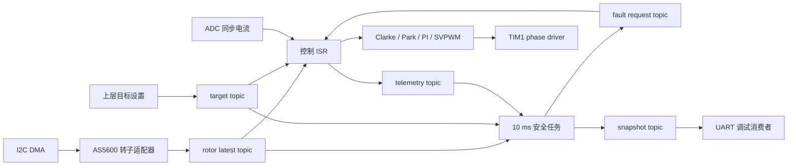
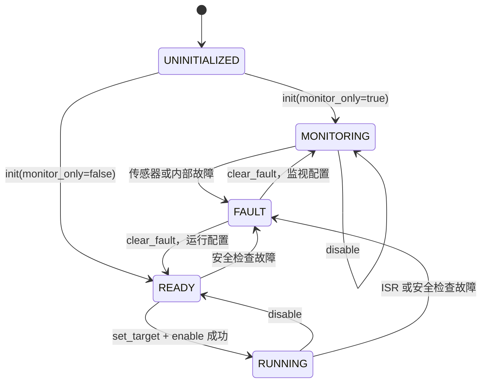

# FOC 核心调用链说明

## 一、结论

当前 FOC 框架已经形成清晰的三层调用链：

1. 1 ms 高频 FreeRTOS 任务负责驱动 AS5600 进行 I2C 采样。
2. 10 ms 低频 FreeRTOS 任务负责通信超时检查、故障锁存和调试快照汇总。
3. `run_control_from_isr()` 包含完整的电流环和 SVPWM 控制链，但当前工程没有硬件 ISR 调用它。

当前配置为 `monitor_only=true`，没有绑定电流传感器，TIM1 驱动配置中的
`allow_output=false`。因此当前固件只采集和观察 AS5600，不会启动 PWM，也不会把
`MOTOR_EN` 拉到有效电平。

## 二、相关文件

```text
Core/Src/freertos.c
└── MX_FREERTOS_Init()
    └── user_lib/system/start.cpp
        └── start_init_all()
            └── user_lib/devices/foc_dev.cpp
                └── foc_dev::init()

user_lib/drivers/foc/
├── foc_core.h/.cpp
├── foc_math.h/.cpp
├── foc_types.h
├── phase_driver/
│   ├── phase_driver.h
│   └── tim1_phase_driver.h/.cpp
└── sensors/
    ├── rotor_sensor.h
    ├── current_sensor.h
    ├── encoder/as5600_rotor_sensor.h/.cpp
    └── current_sense/stm32_two_shunt_current_sensor.h/.cpp
```

`foc_core` 只依赖三个抽象接口：

- `rotor_sensor`：任务采样，任务或 ISR 获取最新转子数据。
- `current_sensor`：校准和 ISR 同步读取相电流。
- `phase_driver`：初始化、使能、禁能、写入三相 duty 和读取硬件故障。

具体的 AS5600、ADC1 双电阻采样和 TIM1 PWM 细节不会进入核心算法。

## 三、总体数据流



所有 Topic 都是 `latest_topic<T>`，底层使用长度为 1 的静态 FreeRTOS Queue：

- 发布者使用 `xQueueOverwrite()` 或 `xQueueOverwriteFromISR()` 覆盖旧值。
- 消费者使用 `xQueuePeek()` 或 `xQueuePeekFromISR()` 读取但不移除数据。
- 消费者如果关心数据是否更新，应比较 `sequence`，而不是等待 Queue 再次变为非空。

## 四、启动与初始化调用链

### 4.1 CubeMX 到用户代码

系统启动时，CubeMX 生成的 `MX_FREERTOS_Init()` 在创建默认任务前调用：

```text
MX_FREERTOS_Init()
└── start_init_all()
    ├── foc_dev::init()
    ├── led_dev::init()
    ├── mpu6050_dev::init()
    └── sensor_debug::init()
```

此时调度器尚未开始运行，但可以创建静态 Queue 和 FreeRTOS 任务。新建的任务会在
调度器启动后才真正执行。

### 4.2 `foc_dev::init()`

当前实际调用顺序为：

```text
foc_dev::init()
├── timebase::init()
│   └── 启动 TIM5 作为 1 MHz、32 位自由运行微秒时基
├── foc_core::link_rotor_sensor(rotor)
│   └── 绑定静态 AS5600 转子适配器
├── foc_core::link_phase_driver(phase_output)
│   └── 绑定静态 TIM1 三相驱动
├── foc_core::init(make_monitor_config())
├── xTaskCreate(foc_sensor_task_entry)
└── xTaskCreate(foc_safety_task_entry)
```

当前没有调用 `link_current_sensor()`。这是监视模式允许的；如果以后把
`monitor_only` 改为 `false`，缺少电流传感器会使 `foc_core::init()` 返回
`NOT_LINKED`。

### 4.3 `foc_core::init()`

核心初始化分为以下阶段：

1. 拒绝重复初始化。
2. 检查转子传感器和相驱动是否已经绑定。
3. 运行模式下额外要求电流传感器已经绑定。
4. 校验方向、周期、超时、母线电压、电流上限和 PI 参数。
5. 初始化目标、ISR 遥测、慢速故障请求和调试快照四个 Topic。
6. 调用 `phase_driver::init()`。
7. 如果已经绑定电流传感器，则调用 `current_sensor::init()`。
8. 根据配置进入 `MONITORING` 或 `READY` 状态。
9. 发布禁用目标、空故障请求和初始快照。

TIM1 驱动的 `init()` 会立即执行以下安全动作：

```text
MOTOR_EN 置为禁用
→ 清除 TIM1 BDTR.MOE
→ CCR1/CCR2/CCR3 写入 50% 中性 duty
→ 标记驱动初始化完成
```

它不会调用 `HAL_TIM_PWM_Start()`。

## 五、1 ms 高频 Bus 传感器链

调度器启动后，`foc_sensor_task_entry()` 每 1 ms 调用一次：

```text
foc_sensor_task_entry()
└── foc_core::update_bus_sensors()
    ├── 首次成功前：rotor_sensor::init()
    └── 初始化成功后：rotor_sensor::update_task()
        └── as5600_rotor_sensor::read_and_publish_sample()
            ├── i2c_bus::read_bytes(0x36, 0x0C, 2 bytes)
            ├── 解析 12 位角度
            ├── 跨零点展开累计角度
            ├── 使用 TIM5 时间戳计算角速度
            └── publish(rotor_sample)
```

如果一次更新成功，连续通信错误计数清零；否则：

```text
bus_update_error_count++
consecutive_bus_error_count++
```

总错误计数用于长期诊断，连续错误计数用于触发慢速安全故障。

任务中还检测本次调用是否已经占满 1 ms。发生错误或超周期时使用普通
`vTaskDelay()` 重新确定节拍，正常时使用 `vTaskDelayUntil()` 保持周期稳定。

## 六、10 ms 低频安全链

`foc_safety_task_entry()` 每 10 ms 执行：

```text
foc_safety_task_entry()
└── foc_core::update_safety(now_ms)
    ├── rotor_sensor::read_task()
    │   └── Peek 最新 rotor_sample
    ├── Peek 最新 foc_target
    ├── 检查连续通信错误
    ├── 检查转子未就绪或样本过期
    ├── 运行状态下检查命令超时
    ├── 必要时发布 fault_request 并锁存故障
    ├── Peek ISR 控制遥测
    ├── 汇总 foc_snapshot
    └── 发布 snapshot_topic
```

默认安全阈值为：

| 项目 | 当前值 | 作用 |
|---|---:|---|
| Bus 更新周期 | 1 ms | 驱动 AS5600 生产最新样本 |
| 慢速安全周期 | 10 ms | 检查通信、时效和命令 |
| 连续通信失败限制 | 10 次 | 触发 `ROTOR_COMMUNICATION` |
| ISR 转子硬超时 | 5 ms | 运行中立即禁止继续控制 |
| 慢速转子超时 | 50 ms | 任务层锁存故障 |
| 命令超时 | 100 ms | 非监视运行状态下检查 |
| ISR 遥测分频 | 20 | 每 20 个控制周期发布一次 |

`latch_fault()` 是共同的最终故障入口：

```text
故障位按位锁存
→ 状态切换为 FAULT
→ D/Q PI 积分清零
→ phase_driver::disable_output()
```

故障不会自动清除。`clear_fault()` 会先保持硬件禁能并确认驱动 Fault 已经解除，
然后才能清除软件故障位。若根因仍在，下一次低频检查会再次锁存故障。

## 七、控制 ISR 调用链

### 7.1 当前接入状态

`run_control_from_isr()` 已实现并由主机测试覆盖，但当前工程源码中没有 ADC、TIM
或其他硬件 ISR 调用它。当前又处于 `MONITORING` 状态，因此真实固件不会进入后面的
电流环和 PWM 写入路径。

未来应由与 ADC 注入转换或 PWM 中点严格同步的中断调用，例如：

```cpp
foc_core::run_control_from_isr(timebase::now_us());
```

在真正接入前还需要确认 ADC 采样点、ISR 优先级、执行时间、TIM1 Break、功率级
Fault 路径和输出启动顺序。

### 7.2 ISR 内部执行顺序

进入 `RUNNING` 后，每个控制周期的完整链路为：

```text
run_control_from_isr(timestamp_us)
├── 检查核心已初始化且状态为 RUNNING
├── Peek 慢速 fault_request
├── 查询 phase_driver 硬件 Fault
├── current_sensor::read_conversion_from_isr()
├── 检查电流有效性、NaN/Inf 和过流
├── rotor_sensor::read_from_isr()
├── 检查转子样本有效性和 5 ms 硬超时
├── Peek foc_target
├── 对足够新的角度按角速度有限前推
├── 机械角 × 方向 × 极对数 + 电角零偏
├── normalize_angle()
├── Clarke：Ia/Ib/Ic → Iα/Iβ
├── Park：Iα/Iβ → Id/Iq
├── 电压模式：直接取 Ud/Uq
│   或
├── 电流模式：Id/Iq 误差 → D/Q PI → Ud/Uq
├── D/Q 电压矢量限幅
├── 逆 Park：Ud/Uq → Uα/Uβ
├── SVPWM：Uα/Uβ → duty_a/b/c
├── phase_driver::write_duty_from_isr()
└── 按 telemetry_divider 分频发布控制遥测
```

任何关键输入无效、样本过期、过流、硬件 Fault、目标丢失或 duty 越界，都会调用
`latch_fault()` 并立即禁能输出。

### 7.3 电压模式和电流模式

电压模式直接使用目标中的 `d_axis_voltage_v` 与 `q_axis_voltage_v`，随后仍会执行
矢量限幅、逆 Park 和 SVPWM。

电流模式以目标 `Id/Iq` 减去实测 `Id/Iq` 作为误差，运行两个独立 PI。PI 包含：

- 积分项限幅；
- 输出限幅；
- 条件积分抗饱和；
- 禁能或故障时积分清零。

## 八、目标、使能与禁能链

真实运行模式下，正常顺序应是：

```text
完成 link
→ foc_core::init(run_config)
→ Bus 任务取得有效转子样本
→ 完成电流零偏校准
→ foc_core::set_target(target)
→ foc_core::enable()
→ 状态进入 RUNNING
→ 硬件同步 ISR 周期调用 run_control_from_isr()
```

`enable()` 依次检查：

1. 核心已经初始化。
2. 不是监视模式。
3. 没有已锁存故障。
4. 转子、电流和相驱动均已初始化。
5. Topic 中存在非 `DISABLED` 目标。
6. `phase_driver::enable_output_task()` 成功。

当前 `tim1_phase_driver_config.allow_output=false`，即使误把上层配置改为运行模式，
驱动层仍会拒绝启动输出。这是独立于 `monitor_only` 的第二道软件许可。

`disable()` 可以在任务上下文主动调用：它会禁能硬件、清空 PI，并根据配置回到
`MONITORING` 或 `READY`。如果已有锁存故障，状态仍保持 `FAULT`。

## 九、调试快照消费链

低频安全任务每 10 ms 发布一次 `foc_snapshot`。调试任务每 100 ms 执行：

```text
sensor_debug_task_entry()
└── foc_core::peek_snapshot()
    └── UART 输出状态、故障位、角度、速度、序号、时间戳、样本年龄和错误统计
```

调试任务通过 `snapshot.sequence` 判断是否出现新快照，因此不会改变核心 Topic 中的
数据，也不会阻塞生产者。

## 十、状态机



## 十一、当前需要注意的边界

### 11.1 ISR 链尚未接入

目前不能把主机测试中 `run_control_from_isr()` 成功理解为实机闭环已经启用。当前没有
生产代码调用该函数，也没有绑定和校准 ADC1 电流传感器。

### 11.2 目标时间戳由调用方提供

`set_target()` 会自动更新 `sequence`，但不会自动填写 `timestamp_ms`。未来上层发送
运行目标时必须使用与 `update_safety()` 相同的时间基填写该字段，否则命令超时判断
会失真。

### 11.3 AS5600 故障不会自动恢复

AS5600 独立供电异常时，1 ms 任务会继续累计通信错误，10 ms 安全层会锁存
`ROTOR_COMMUNICATION` 和/或 `ROTOR_NOT_READY`。当前按设计没有 GPIO 模拟时钟或其他
总线恢复流程，需要重新给 AS5600 上电，随后显式调用 `clear_fault()` 或重新复位系统。

### 11.4 单实例边界

`foc_context` 和四个 Topic 都是 `foc_core.cpp` 内的静态单例。它适合当前单电机方案，
但不能直接创建第二套电机实例；若以后需要双电机，应先决定复制命名空间实例、模板
实例化，还是改成显式 `foc_controller` 对象。

## 十二、建议的下一步接入顺序

1. 确认分流电阻、运放增益、ADC 极性和零点配置。
2. 实例化并绑定 `stm32_two_shunt_current_sensor`。
3. 完成禁止功率输出状态下的 ADC 零偏校准。
4. 确认 TIM1 PWM 触发 ADC 的采样点。
5. 在同步 ISR 中接入 `run_control_from_isr()` 并测量最坏执行时间。
6. 接入 TIM1 Break 与门极驱动 Fault 的完整硬件链。
7. 设置真实极对数、母线电压、电压/电流限制和 PI 参数。
8. 最后才同时解除 `monitor_only` 与 `allow_output` 两道许可。

在以上条件完成前，保持当前监视模式是合理且必要的。
